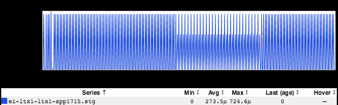
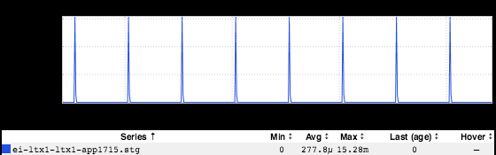
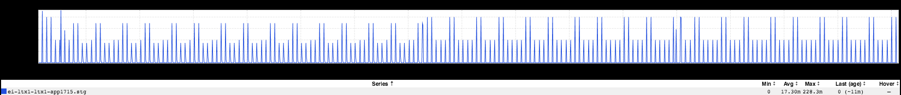
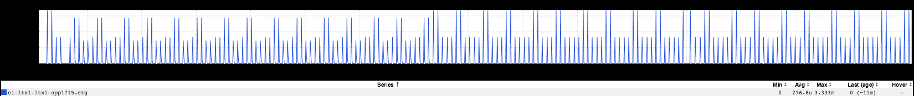

+++
title = "Mystery Edition"
date = "2018-03-01"
slug = "mystery-edition"
draft = false
+++

[I got nerd-sniped](https://xkcd.com/356/) earlier this week by _Kathleen Shannon. She sent this inGraph my way:_

Huh. Okay. Interesting. First and foremost: it looks super-cool, right? ...but what's going on here? Well, a coupla bits of data here:

1. A snapshot link to this inGraph: [https://ingraphs.prod.linkedin.com/snapshot/k2-nlp-snapshot_20180302_003619/](https://ingraphs.prod.linkedin.com/snapshot/k2-nlp-snapshot_20180302_003619/)

2. It's backed out to 8 days' worth of data, which should be at least roughly apparent via the legend but it's worth calling out.

3. It's a count...and as counts go, 600u (0.0006) is...well...a pretty small number.

I think at this point it might be worth taking a step back and talking about how GC metrics are emitted. Below are two metrics for 8 hours' worth of data that are roughly equivalent:

These are two different metrics that effectively represent the same thing. The first metric (GCCount) is garbage collections taken in a minute. Given rounding error and time boundaries - inGraphs data are minutely, for the most part - a value somewhere around 1 makes sense; this service does 1 mark- sweep GC an hour, and for that minute the number of GCs is 1. The second metric (CollectionCount) is per-second, and also makes sense; 1 GC every 60 seconds = 1/60 = 0.016...which is what we see in the inGraph. As an exercise for the reader: why do we emit two metrics, one of which is just the other divided by 60?

Anyhow...what about when we back it out to 8 days? I've seen some issues before with how inGraphs [drops granularity in aggregation...but still, something ](/igotw/2017-10-19-rrds-and-granularity/) isn't quite right here. Extending the horizontal scale of the inGraph changes things a bit, but doesn't seem to quite give a satisfactory result:

It's interesting that the difference is consistent (roughly a factor of 5 for either metric), but I haven't quite found a way to reconcile these number even given loss of granularity.

So...who knows what the fuck is going on here?

