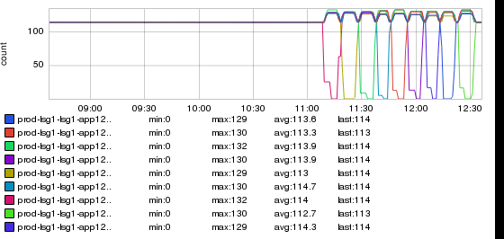

+++
title = "Ups & Downs"
date = "2018-03-08"
slug = "ups-downs"
draft = false
+++

This week's igotw comes from _Ben Weir_:

_There are a handful of things I really like about this inGraph. In many cases you don't want to see flatlines_ in your graphs, but this is a great example of a place where it's perfectly fine (in fact expected) behavior. I also love the sort of Newtonian symmetry of the thing. Oh, and then there's the fact that it kinda reminds me of a swingset. ...so, what is it? Well, in Ben's own words:

*This is what a rolling upgrade of a Couchbase cluster looks like. In couchbase, each bucket is logically divided into 1024 “vbuckets” or partitions* *which are then distributed evenly across nodes in the cluster. In order to upgrade Couchbase, we fail out one node from the cluster. During failout,* *that node hands off its vbuckets to other members in the cluster. Then we take that node offline, upgrade it, and rebalance it into the cluster. Repeat* *for all nodes and when the last one is upgraded you are done. This type of upgrade can be performed on a live cluster with without impact to clients.*

Bitchin'. Thanks for passing it along, Ben!

**Update:** Woops! Forgot to drop a snapshot link in. Here it is if you wanna play with it a bit yourself: [http://ingraphs.prod.linkedin.com/snapshot](http://ingraphs.prod.linkedin.com/snapshot/vbuckets_per_node_20180301_203746/) [/vbuckets_per_node_20180301_203746/](http://ingraphs.prod.linkedin.com/snapshot/vbuckets_per_node_20180301_203746/)
