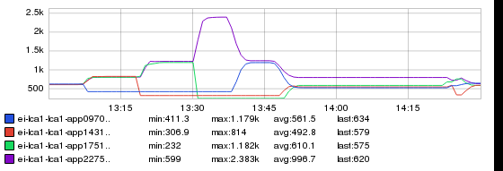
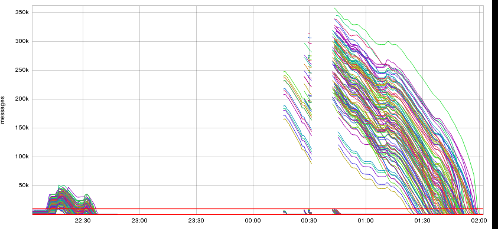
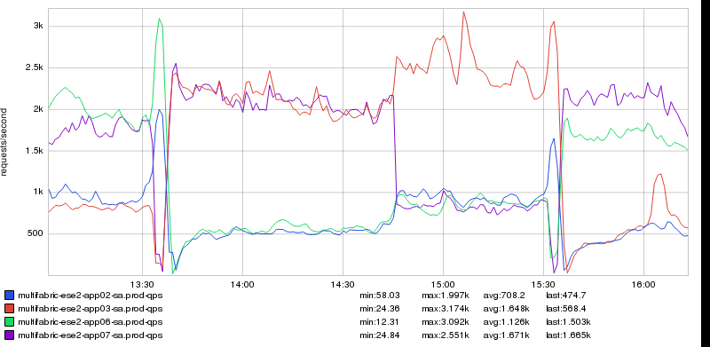

+++
title = "Unintentional Art"
date = "2018-03-16"
slug = "unintentional-art"
draft = false
+++

Folks send me dashboard/snapshot links and screen caps of inGraphs all the time. Somewhere along the way I decided it would be a good idea to try and keep track of who sent what so I could provide proper attribution. Typically this takes the form of throwing the submitter's name into the filename of the image, along with a string that is at least reasonably descriptive of what the thing is. (I don't always do such a great job of this latter bit...you'll see.) The below are a handful of rad inGraphs UA and their respective filenames.

First up, I give you **knecht-thinger.png**:

I *told* you I didn't always do a good job on the "descriptive" part.

Next, **kafka-rainbow-tony-garbanzo.png**:

Then we've got the thematically similar **dark-side-of-the-moon-ncbrown.png**:

...and, taking us on home, **l0-deployment-and-rebalance-dsnyder.png**:

_Many thanks to Matt Knecht __Anthony Gargiulo __Nick Brown__, __, __, and __David C. Snyder_ for sending these my way!

