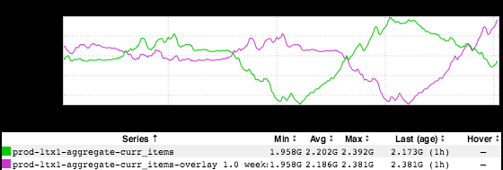
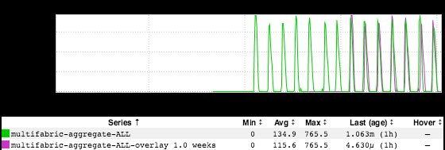

+++
title = "Don't Cross the Streams"
date = "2018-03-22"
slug = "don-t-cross-the-streams"
draft = false
+++

[Aatif Awan recently moved on to his Next Play. That got me thinking about one of the very ](https://www.linkedin.com/in/aatifawan/)[first igotw posts I ever wrote, referencing Aatif's ](/igotw/2016-01-14-less-is-more/)[blog post](https://blog.linkedin.com/2015/07/27/less-email-from-linkedin) about LinkedIn sending fewer emails. For those too lazy to click, here's what that looked like from the perspective of the deduplication cache that stork uses:

...and here's what it looks like today (on a much shorter time scale - 2 weeks instead of ~7 months):

A few things stand out here. First and foremost: the new max is around 2.3G (2.3 **billion** messages sent), which doesn't seem at all in line with the spirit of Aatif's post. That probably bears a little explanation. We also leverage this cache for deduping push notifications, and we send **way** more pushes now than we did in 2016. I don't have numbers in front of me, but I think it's quite likely that we send more pushes than we do emails at this point. ...and before getting too bent out of shape about that - "Hassling members via push notification is worse than spamming them with email!" - know that:

1. _We have a whole team of super-smart folks whose job it is to ensure that we're not pissing members off with too many pushes (see: Honeycomb_), and

2. A significant percentage of these pushes - I'd wager a plurality, if not an absolute majority - are "silent"...i.e., they do not trigger an actual audible /visible notification. For example, pushes that change bits of application state like badge counts.

Another thing that caught my eye is of course this lovely emergent argyle pattern from the criss-crossing of current-week and week-over-week. Now, I'm not positive what the dip starting around March 4th or 5th is (perhaps just trailing impact from the weekend, when we send fewer emails), but I did a little poking around and I reckon the uptick starting on the 8th is likely the latest round of Terms of Service emails that we're obligated to send to all members reachable via email:

At any rate, many thanks to Aatif - both for all the awesome work he did in his time at LinkedIn, as well as for indirectly providing me with material for (at

least) two igotw posts.
