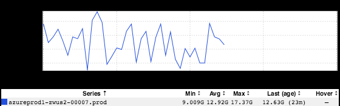
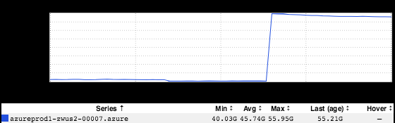
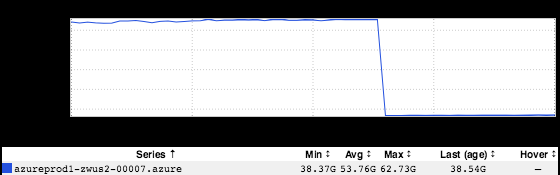
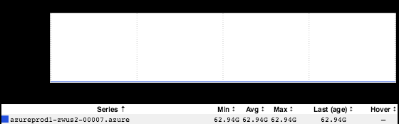
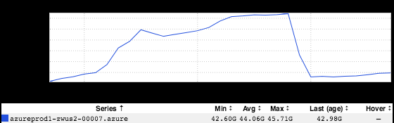

+++
title = "Fear of Commitment"
date = "2018-03-29"
slug = "fear-of-commitment"
draft = false
+++

Yesterday _Juan Grande came to me with a question about a service that had barfed trying to allocate memory for a new thread. For folks who have seen a _ JVM blow up before, this log snippet should look pretty familiar:

# There is insufficient memory for the Java Runtime Environment to continue. # Native memory allocation (mmap) failed to map 12288 bytes for committing reserved memory. # An error report file with more information is saved as: # logs/hs_err.log Java HotSpot(TM) 64-Bit Server VM warning: INFO: os::commit_memory(0x00007f46819d4000, 65536, 1) failed; error='Cannot allocate memory' (errno=12) [thread 139940045235968 also had an error] Java HotSpot(TM) 64-Bit Server VM warning: INFO: os::commit_memory(0x00007f4529ca0000, 12288, 0) failed; error='Cannot allocate memory' (errno=12) [thread 139935031625472 also had an error] Exception in thread "pool-10-thread-455" java.lang.OutOfMemoryError: unable to create new native thread

In inGraphs, it looked something like this:

...which is to say, metrics stopped emitting when the container crashed and burned. Note the name of the sensor above. If there is that much free memory available then why did the JVM throw an OutOfMemoryError? Well, let's take a peek at free memory on the box:

Around 40GB free (until this container died, which freed up quite a bit). So what the shit is going on here? Well, let's take a look at how much memory is committed, which is different than memory actually being used. (It's outside the scope of this post to give an in-depth primer about committed memory, but some reasonably good doc on /proc/meminfo can be found [here](https://access.redhat.com/documentation/en-us/red_hat_enterprise_linux/6/html/deployment_guide/s2-proc-meminfo) if you're interested.)

Okay, so something like 62.7G (just before the crash). ...and what's the upper bound on committed memory?

Ah. Now we're getting somewhere. So:

1. The OS was approaching its committed memory limit.

2. This service attempted to allocate One More Thread, which would've put the OS over that limit.

3. The OS refused, the JVM died...and that was that.

Okay, that's pretty straightforward. Threads may be inexpensive, but they're not free. ...but why only on this one box? This same service runs on multiple nodes and only seemed to have choked on this one. Well, there are a handful of possible reasons for that, but one interesting tidbit of information: this happened to be the only box that was also running a service named **noop-app** (which Juan also noticed - good eye, Juan!) Well, what role might it have played here? Let's take a peek at how much heap it's rocking:

20:22:23 csnyder@zwus2-00007 ~ (0) $ sudo -u app /export/apps/jdk/JDK-1_8_0_72/bin/jmap -dump:live,format=b, file=noop-heap.bin 31426 Dumping heap to /tmp/hsperfdata_app/noop-heap.bin ... Heap dump file created 20:22:58 csnyder@zwus2-00007 ~ (0) $ ls -lh /tmp/hsperfdata_app/noop-heap.bin -rw-------. 1 app app 41M Mar 28 20:22 /tmp/hsperfdata_app/noop-heap.bin

Not a whole lot...but as we saw before heap size was never the problem to begin with. Can we take a look at what that container has committed. Well, unfortunately I don't know of a great way to do that. For a JVM that's running on a machine with a buncha other JVMs the output of pmap is going to spit

out a whole lot of shared objects and whatnot. (If anyone knows of a way, I'd love to hear it! ) What if we take an empirical approach? We'll check the overall amount of committed memory, kill the sumbitch, and the re-check the amount of committed memory immediately after.

20:38:56 csnyder@zwus2-00007 ~ (0) $ cat /proc/meminfo | grep -i commit CommitLimit: 61462764 kB Committed_AS: 44649352 kB 20:39:03 csnyder@zwus2-00007 ~ (0) $ sudo -u app kill -9 31426 20:39:09 csnyder@zwus2-00007 ~ (0) $ cat /proc/meminfo | grep -i commit CommitLimit: 61462764 kB Committed_AS: 41706216 kB

Now we're getting somewhere. It looks like something 3GB was freed up. "Hey, this is igotw! How's about some corroborating evidence in the form of an inGraph?" Ask and ye shall receive; the inGraph of committed memory just before and after I killed noop-app:

Nifty.
