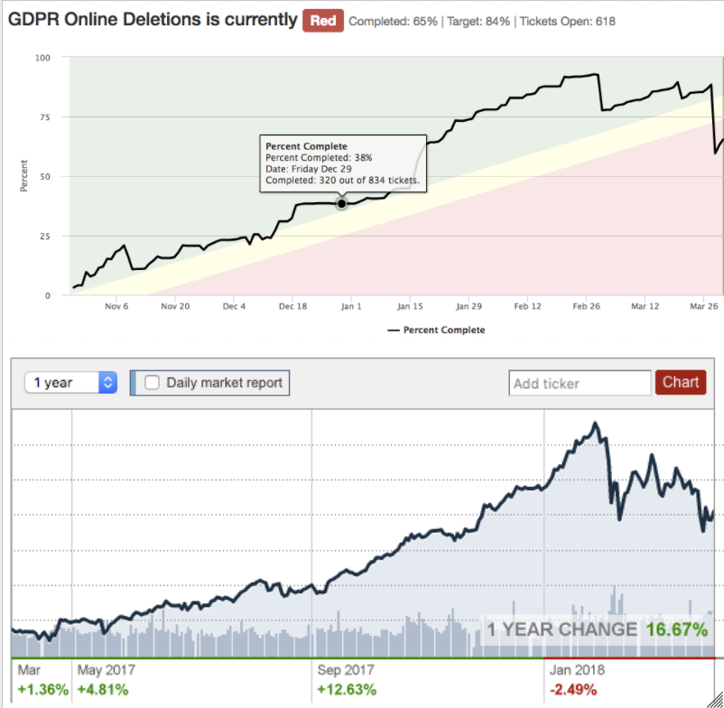
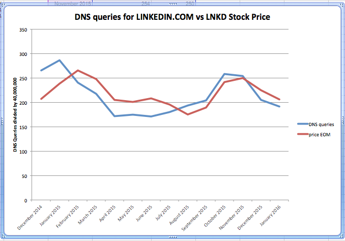

+++
title = "Correlation != Causation"
date = "2018-04-06"
slug = "correlation-causation"
draft = false
+++

Today's post is a couple of fun little graphs. Neither is actually an inGraph, but both are good reminders that [correlation does not imply causation](https://en.wikipedia.org/wiki/Correlation_does_not_imply_causation). Let's take a peek:

I stumbled across this pair of graphs showing a pretty tight correlation between progress on the GDPR Online Deletions horizontal initiative and Dow Jones _performance (IIRC thanks go to Xin Cai_ for throwing this one together). The astute reader will note that the timelines are not at all aligned...but it's a fun one all the same. Close your tickets, folks - you may just be hurting our economy! ;-)

_It reminded me of this little gem that Jim Ockers shot my way around the time I first started igotw:_

As the graph title indicates, this lil guy compares DNS queries for linkedin.com against LNKD closing prices. ...pretty decent leading indicator, no?

*[Disclaimer: The author of igotw does not recommend making investment decisions based upon either of these graphs.]*
