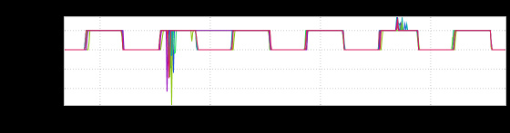
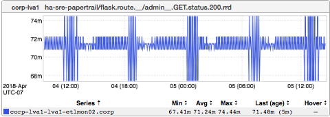
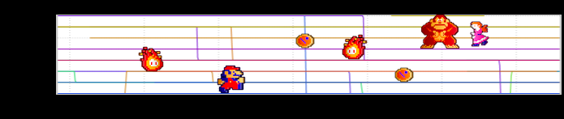
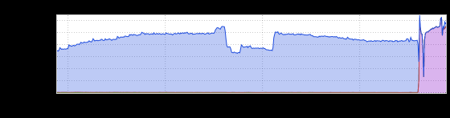

+++
title = "Unintentional Art (NYC Edition)"
date = "2018-04-12"
slug = "unintentional-art-nyc-edition"
draft = false
+++

I'm working from our [New York office](https://microsites-internal.corp.linkedin.com/content/inkwell/gws/en-us/GWSHome/NewYork) this week, so I thought I'd try to pull together a UA post that's NY-themed. Some of these might be a bit of a stretch, but bear with me:

This is what things look like when sysops does testing by artificially introducing 1ms of latency for periods of time...but it also looks a bit like a (super- regular) skyline. Next up:

This one (from _Richard Waid_) is a little abstract, but when looked at the right way I kinda see the subway. Another one I love:

_Entitled "The Donkey Kong Graph" by Nick Berry_, I have no idea what's actually going on in this one...*but* it includes Mario (an Italian plumber from NYC, if I'm not mistaken). ...and finally:

I should've kept the legend on here. The blue-ish is 2xx responses, the purple-ish is 5xx responses. It demonstrates how quickly everything can change...

[how quickly things can get pretty strange. "How quickly?" you ask? Well...in a New York minute](https://www.youtube.com/watch?v=cZgMtQHB-EA), of course.
