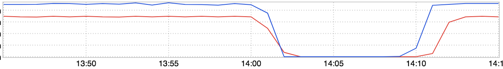

+++
title = "Travel Time"
date = "2018-04-19"
slug = "travel-time"
draft = false
+++

*[Today's igotw is a guest post written by* *Chris Carini* *(the original can be found here: How long does it take to travel across campus?**) Thanks, Chris!]*

Right. So, any idea on how long it takes to get from [Unify in 950 (R), to ](https://cinco.corp.linkedin.com/room/cr-unify@linkedin.com)[Mercury in 580 (J)](https://cinco.corp.linkedin.com/room/cr-mercury@linkedin.com)?

Maybe.. 5-10 minutes?

I suppose it depends if you're walking, biking, driving, or maybe taking the shuttle.

Well, I was walking, so maybe closer to 10 minutes?

According to this inGraph, it took me ~7 minutes (14:09 - 14:02 = 7 min; roughly...)

*"How the hell are you just pulling up some random inGraph to determine this, Chris?!?"* you might be thinking. Fair. Very fair.

Right, so it's pretty simple actually.

I was throwing some traffic at the staging instances of one of the services my team maintains via the beautiful commands below:

(ccarini@ccarini-_mn2.linkedin.biz)(_2018-04-16 @ 15:41:09)[ ~ (master)] $ > history | grep curl | tail -n5 | head -n2 2023  2018-04-16 13:39:57 : HOST=lva1-app1462 ; watch -n 1 "curl -k -o /dev/null -s -w '$HOST - %{time_connect} + %{time_starttransfer} = %{time_total}\n' https://$HOST.corp.linkedin.com:16399/api/v1/plugins/production /updatePlugins.xml >> timeit-$HOST.txt" 2024  2018-04-16 13:40:13 : HOST=lca1-app1412 ; watch -n 1 "curl -k -o /dev/null -s -w '$HOST - %{time_connect} + %{time_starttransfer} = %{time_total}\n' https://$HOST.corp.linkedin.com:16399/api/v1/plugins/production /updatePlugins.xml >> timeit-$HOST.txt" (ccarini@ccarini-_mn2.linkedin.biz)(_2018-04-16 @ 15:41:23)[ ~ (master)] $ >

The Speaker Series talk I was attending had just wrapped up. *Close* goes my laptop, and back to my desk. I open my laptop, login, and ***voilà******!!***

"Huh?" you may be thinking.

Well, I never stopped the two watch processes. The act of closing my laptop screen put my computer to sleep, temporarily stopping the processes from sending further requests to my service. Opening my laptop screen then resumed the two watch commands, and the traffic came back!

Neato! Now I have a rough idea of how long it takes to get between the two buildings (not including any variance we might get from traffic light timings  ...)

Do you have one similar? Maybe we could crowd-source this information and get an accurate 'inter-campus commute time per transportation method' table

started somewhere...  You know, because GDPR is almost 'over'...

***Note:*** *I intentionally didn't include the title of the inGraph, as it's really not relevant here; this could be accomplished with any service you're able to send* [*traffic to (and easily distinguish when your traffic started / stopped). If you're really curious, you can find the specific inGraph here.*](https://ingraphs.prod.linkedin.com/container/lintellijps/graph/lintellijps/flask.route.__/api/v1/plugins/production/updatePlugins.xml__.GET.status.200.rrd?fabric_groups=corp&hosts=lca1-app1412.corp.linkedin.com&hosts=lva1-app1462.corp.linkedin.com&multifabric=false&auto_refresh=1&use_time_selector&width=610&height=58&legend=false&end_time=1523913300000&start_time=1523911500000)
