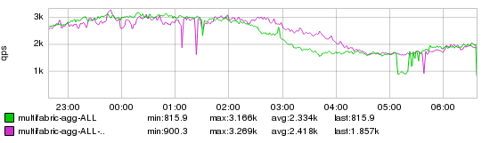

+++
title = "The Good Ship Lodbrog"
date = "2018-04-26"
slug = "the-good-ship-lodbrog"
draft = false
+++

Per [Wikipedia](https://en.wikipedia.org/wiki/MS_Lodbrog):

***Lodbrog*** is a 10,243 [GT](https://en.wikipedia.org/wiki/Gross_tonnage) cable laying ship that was built as a freight ferry. She was built in 1983 as ***Siegelberg*** and completed in 1985 for [Romanian](https://en.wikipedia.org/wiki/Romania) owners as ***Tuzla***. In 1996 she was renamed ***Bolero***. The ship was renamed *Lodbrog* after conversion to a cable layer in 2001.

_The fuck does this have to do with anything? Well...I was chatting a bit with some folks earlier this week and it triggered a memory of a DS3_ from Way Back When. At the time I was relatively new to LinkedIn. I'd only been to a handful of these daily standups, and this particular one was fairly formative with [respect to my understanding of the scope & scale at which LinkedIn operates. Specifically, one of the topics of discussion was GCN-19289](https://jira01.corp.linkedin.com:8443/browse/GCN-19289). Unfortunately, the only inGraph remaining is relatively lame:

If I had more inGraphs from that timeframe I'd gladly provide them, but it was quite a while back and there really isn't much data left to point to. This graph - included in the GCN ticket - shows impact to metrics due to high latencies/dropped traffic in China. The interesting bit is the **why** of the thing. The tl;dr: a submarine cable somewhere in the Pacific was cut and it had direct impact on our ability to serve traffic in Asia, which impacted growth metrics for China (which was - and still is - a large growth market). This was obviously completely outside of our control; we basically had to wait until Some Dudes with Some Gear got on A Boat and went out to Sort It. The thing that really struck me - I mean, what really made this ticket sink home: *the name of the fucking* *boat is in the ticket!* A couple of examples for the folks who don't wanna click through to the ticket:

*cable ship* ***Lodbrog*** *will arrive at the repair ground of cable break off Taiwan (755km from HKG) on 21 Aug and the tentative repair completion date* *is on 30 Aug.*

...and then, a bit of a setback:

*The tentative commence date and completion date will be on 4 Nov and 10 Nov respectively. This was delay Due to recent Typhoon DuJuan across* *Taiwan, cable ship* ***Lodbrog*** *is mobilized to first repair EAC segment K and then FLAG segment N, which have higher repair priority. Therefore, the* *RNAL shunt fault repair will be further postponed.*

Holy shit, guys. This isn't some mom-n-pop shop. We are - to steal a bit of a j-dubs-ism - "on a global basis".

Full stop.
