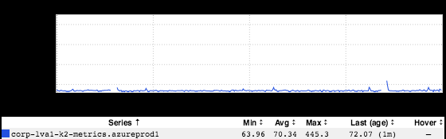
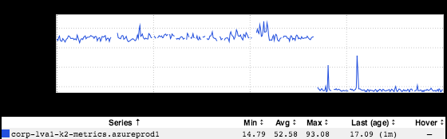

+++
title = "Steps to Improvement"
date = "2018-05-03"
slug = "steps-to-improvement"
draft = false
+++

A bit of background: the k2-sre team is working on a Python multiproduct called _azmon_. The purpose of azmon is to MONitor AZure resources (clever

naming, I know _). It came about in order to meet some of the monitoring needs of the K2 project. The mechanics are straightforward: pull metrics from _ Azure's monitoring API and stuff them into AMF such that we can put them on inGraphs dashboards, alert on them, etc. The polling frequency is once a minute, selected due to the frequency at which RRD expects to receive data; per the _docs for AMF:_

*Due to the use of RRD files as the underlying data storage format for metrics at LinkedIn, metrics must be emitted no lesser than about once every* *60 seconds. If metrics are not emitted at this frequency, when querying the data from the RRD file, the returned value might become NaN for that* *time period.*

This worked fine for a while, but as we iterated and started adding more resources to monitor we started noticing gaps in the metrics. Taking a look at the logs revealed that metrics collection was actually taking **more** than 60 seconds...and we were getting precisely the results that the doc indicated (NaNs for some time periods). So, what to do about it? Well, mebbe we could like batch up calls to the API, or do some multithreading, or have a blacklist for metrics [we don't actually want/need, or...wait. Hold up. First things first. What gets measured gets improved. So let's start emitting a metric for how long it's actually ](https://en.wikiquote.org/wiki/Talk:Peter_Drucker) taking:

Kind of a boring little inGraph, but here's what it buys us:

1. It gives us definitive signal that collection of these particular metrics (metrics about Azure VMs) is taking more than 60 seconds (70.34 seconds, on average)

2. It shows that it's **consistently** taking more than 60 seconds (as opposed to us anecdotally seeing times >60 seconds in the logs)

3. When we make changes to try and improve upon this, it will give us signal as to whether what we did actually worked (again, as opposed to anecdotally poking through the logs)

Cool. So, time to make a change. We mentioned batching above, how about if we try that? Instead of grabbing metrics one at a time let's try getting 5 at a

time. *[Side note: Why 5? Well, as it turns out there's an (undocumented) limit of 5 in the Python Azure monitoring client provided by Microsoft.* *]* Assumin g run time is dominated by the call to the Azure API that should give us something like a 5x speedup, give or take, right? Let's see:

Yep...70/5 = 14. Yay arithmetic! We've got some intermittent spikes to figure out, but it looks like we're on the right track.

[If you want to play with this graph yourself: https://ingraphs.prod.linkedin.com/host/k2-metrics.azureprod1.linkedin.com/?fabrics=corp-lva1&filter=vm.](https://ingraphs.prod.linkedin.com/host/k2-metrics.azureprod1.linkedin.com/?fabrics=corp-lva1&filter=vm.runtime) [runtime](https://ingraphs.prod.linkedin.com/host/k2-metrics.azureprod1.linkedin.com/?fabrics=corp-lva1&filter=vm.runtime)
