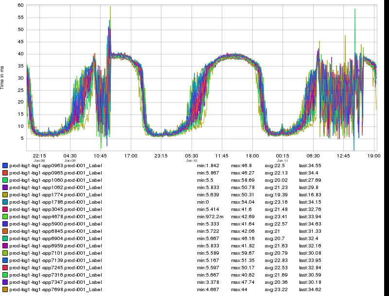
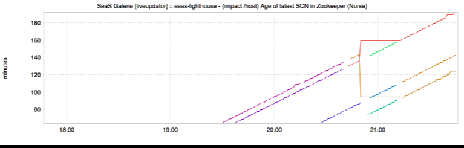
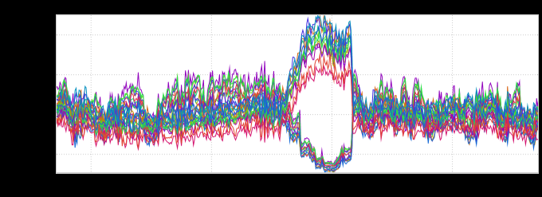

+++
title = "Unintentional Art (PyCon Edition)"
date = "2018-05-10"
slug = "unintentional-art-pycon-edition"
draft = false
+++

[I'm heading to PyCon 2018](https://us.pycon.org/2018/about/) a little later today, so I wanted to do a post on something Python-related. My first thought was to grep around in inGraphs dashboards. Perhaps unsurprisingly, that approach didn't really provide particularly fruitful. I *did* have to chuckle a bit when I saw the note *"If /tmp is filled,* *Python starts throwing Bus Errors. Please clear up /tmp."* in one dashboard - yepyep, seen that one before - but I still didn't really have any inGraphs to show for my efforts.

Then I thought maybe I could just find an inGraph that looked kinda snake-like. Well, I've got plenty of undulating inGraphs - like this lil guy:

[...but it still wasn't quite what I was looking for. Well, PyCon is in Cleveland, Ohio](https://www.youtube.com/watch?v=SJ3plaSowWc) this year and next...maybe I've got something that looks kinda like the letter 'C'?

That has a block C in it...and then there's this one:

...which I know I've posted before, but still...it looks rad *and* (vaguely) C-like. Hrm. Not wholly satisfying.

So. In an attempt to make this week's post not a *complete* bust, I thought I'd share a little TamperMonkey script I wrote a while back. The way it came to be: I frequently want to go back and find a particular post - maybe it's applicable to a particular situation, or I want to check whether I've posted a specific inGraph already, or maybe I just want to reference something I talked about previously. Confluence provides a handy set of links in the left nav, but they're all squirreled away in these infuriating nested menus that are collapsed by default. I googled around a bit trying to find a way to make them all auto-expand without much luck...so I wrote this:

**Confluence Expand All**

// ==UserScript== // @name         Confluence Expand All // @namespace    http://tampermonkey.net/ // @version      0.1 // @description  Expand all go/igotw nav subtrees // @author       You // @match        https://iwww.corp.linkedin.com/wiki/cf/pages/viewrecentblogposts.action?key=~csnyder // @grant        none // ==/UserScript==

(function() { 'use strict';

function openAll() { var links = document.getElementsByClassName('navigation-pseudo-link');

for(var j in links) { var link = links[j]; var p = link.parentElement; if(p && p.classList && p.classList.contains('closed')) { link.click(); } } }

$(document).ready(function() { // run 3 times with a second in between each to give them time to open up setTimeout(openAll, 1000); setTimeout(openAll, 2000); setTimeout(openAll, 3000); }); })();

Yes, it's hack-y - I think the statement "There is almost certainly a better way to do this" likely applies to All Software Ever - but it's effective and took all of

20-30 minutes to write (most of which was spent digging around in the DOM finding the elements I needed). Hopefully someone else finds it useful.
