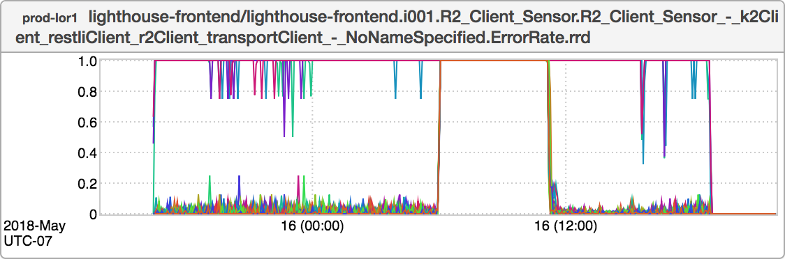
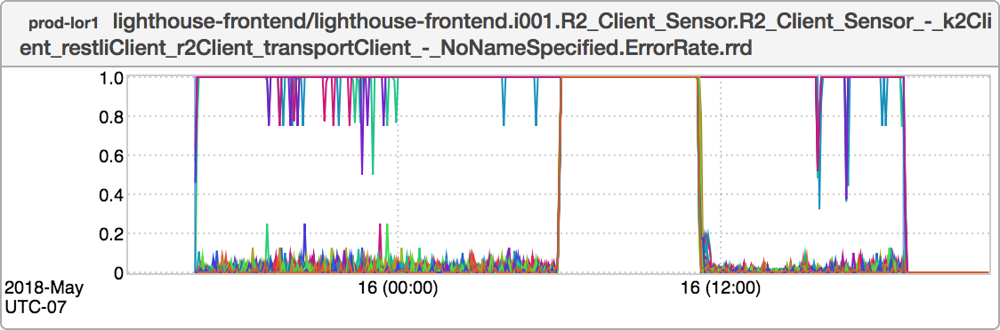
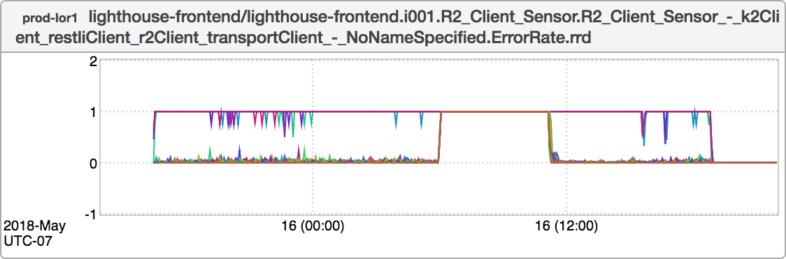

+++
title = "Before You Panic (Limits)"
date = "2018-05-17"
slug = "before-you-panic-limits"
draft = false
+++

So, a Thing Happened yesterday:

There are a couple of interesting tidbits to note here:

NoNameSpecified is probably not the most descriptive name for this sensor to have; we'll wanna fix that. It is an excellent example of _The Dreaded Plateau._ This is an ErrorRate sensor (errors divided by requests) and it's plateauing at 1.0 (i.e., 100%). This is probably not desired behavior.

Since we're taking a peek at this *post hoc* I happen to know what caused this - specifically, the lix sn4x-use-k2-api - so it's a good opportunity to revisit the [informed overlay:](/igotw/2017-07-28-informed-overlay/)

Subtle. So subtle, in fact, that as I'm writing this I'm second-guessing which of the two graphs is which. Well, let's see if fiddling with the limits can help us out here. In the "Controls" part of the UI there are a couple of text boxes that look like this:

Under normal circumstances inGraphs picks what it considers to be a "sane" upper/lower bound for graphs, but these can also be set manually either in the dashboard definition or using these handy little text boxes. Let's try setting the Lower Limit to -1 and the Upper Limit to 2:

Ah, now I think we're getting somewhere. Now with the informed overlay:

Aha! Plain as day. Sometimes the plotted lines themselves are going to going to obscure your informed overlay. This is one mechanism you might use to [gain a little clarity, there are likely a handful of others. If you want to play with the graph yourself it can be found here.](http://ingraphs.prod.linkedin.com/container/lighthouse-frontend/graph/lighthouse-frontend/lighthouse-frontend.i001.R2_Client_Sensor.R2_Client_Sensor_-_k2Client_restliClient_r2Client_transportClient_-_NoNameSpecified.ErrorRate.rrd?filter=noname&fabrics=prod-lor1&use_time_selector&start_time=1526418000000&end_time=1526533200000&legend=false)

