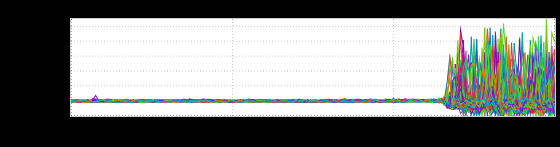
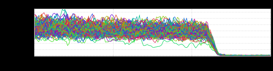
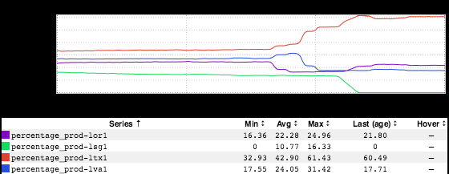

+++
title = "Before You Panic (Context)"
date = "2018-05-25"
slug = "before-you-panic-context"
draft = false
+++

I'm **certain** I've posted about this kind of thing before but I reckon it bears repeating: you're going to want to have a little context around what your metrics actually mean before pressing the panic button. Let's take a peek at an example, shall we?

This a Latency inGraph of Greatness. Speaking broadly a graph like this probably **should** evoke a response of "Hrrrnnnnnng what the shit?!" In fact, that's what I think I said when I first saw it. Honestly, it doesn't matter what the specific metric is all that much - when you see everything humming along nice- and-tight and then go completely apeshit then it may be something you'll want to look into. Well, p95 latency is meaningless without understanding what QPS looks like. So let's do a little Due Diligence, shall we? What does the QPS look like?

...and the "why" of the thing: a traffic shift:

Huh. Okay. So, overall QPS dropped at the same time due to a traffic shift. Well, now we're getting somewhere - we can calm down a bit. In technical terms: The Metrics get All Fucked Up at low QPS. Why? Well, all sorts of reasons.

For one thing, the more data points you have the more confident you can be about your 95th percentile. That is, the more confident you can be that 95% of requests are being serviced at or below the reported p95 latency. (I'm not digging into this right now, but hit me up if you're interested...)

For another: we design & build services with (relatively) high QPS in mind. The upshot of this is that shit can get weird at low QPS. When traffic shifts out of a fabric factors can kick in that you never might have had to think about - things like  keep-alive timeouts, session timeouts, stateful firewalls dropping

state, etc. (Apologies, I'm also not delving too deeply here, but I'm happy to talk about it some time )

An even more basic scenario that might resonate, at least at the leading edge of the latency increase: suppose you're moving traffic out of a fabric. The "fast" in-flight requests during that traffic shift complete. ...what's left? Well...the longer-running/"slower" ones, yeah? The "lingerers", if you will. ...so all of a sudden the small number of in-flight requests that took longer than the rest end up dominating the metrics.

**Update:** Woops! Forgot to provide links. Here they are:

[http://ingraphs.prod.linkedin.com/container/comm-inbox-bps/?dynamic=inbound-traffic&fabrics=prod-](http://ingraphs.prod.linkedin.com/container/comm-inbox-bps/?dynamic=inbound-traffic&fabrics=prod-lsg1&filter=mailboxThreads&overlay_amount=0&overlay_unit=hours&consolidate=None&use_time_selector&start_time=1526907600000&end_time=1526918400000&legend=false) [lsg1&filter=mailboxThreads&overlay_amount=0&overlay_unit=hours&consolidate=None&use_time_selector&start_time=1526907600000&end_time=1526](http://ingraphs.prod.linkedin.com/container/comm-inbox-bps/?dynamic=inbound-traffic&fabrics=prod-lsg1&filter=mailboxThreads&overlay_amount=0&overlay_unit=hours&consolidate=None&use_time_selector&start_time=1526907600000&end_time=1526918400000&legend=false) [918400000&legend=false](http://ingraphs.prod.linkedin.com/container/comm-inbox-bps/?dynamic=inbound-traffic&fabrics=prod-lsg1&filter=mailboxThreads&overlay_amount=0&overlay_unit=hours&consolidate=None&use_time_selector&start_time=1526907600000&end_time=1526918400000&legend=false)

[https://ingraphs.prod.linkedin.com/dashboard/stickyrouting/?](https://ingraphs.prod.linkedin.com/dashboard/stickyrouting/?fabric_groups=prod&use_time_selector&start_time=1526907600000&end_time=1526918400000) [fabric_groups=prod&use_time_selector&start_time=1526907600000&end_time=1526918400000](https://ingraphs.prod.linkedin.com/dashboard/stickyrouting/?fabric_groups=prod&use_time_selector&start_time=1526907600000&end_time=1526918400000)

