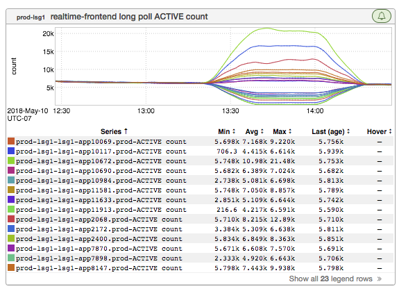
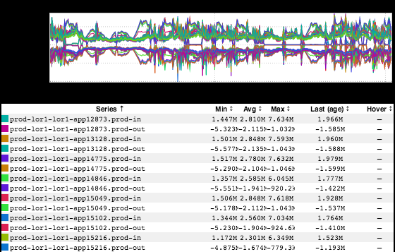
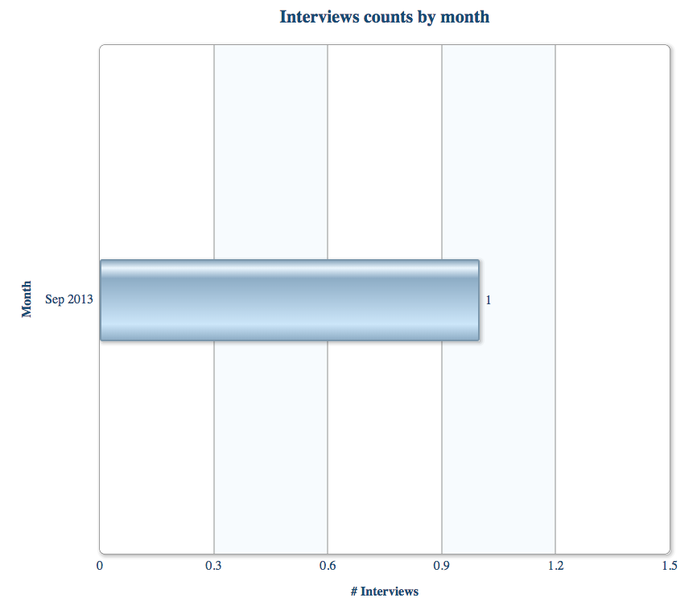
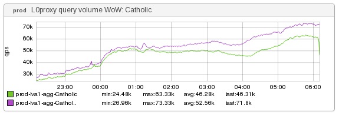
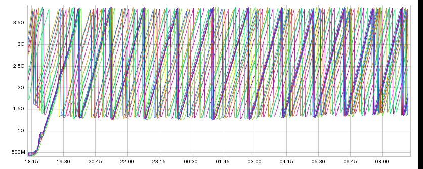

+++
title = "Unintentional Art"
date = "2018-05-31"
slug = "unintentional-art"
draft = false
+++

Now, I hesitate to call this week's igotw random - these are of course all hand-selected, curated, bespoke, artisanal, gourmet graphs for your consumption - but...well, there's just plain no theme this week. I've got a backlog of interesting things I've picked up over the past coupla months, and it's time for that dam to burst. So...it's just plain all over the place. Pandemonium. Let's Dive right in!

_Max Wolffe_ shot this one my way a little while back:

[I've posted multiple times in the past about attempts to improve](/igotw/2016-11-10-load-un-balancing/)_ upon load balancing going awry. Welp. The above is yet another example of that. _

_Next up: an inGraph from Alexsandra McMahan_ that reminded me of a _symmetry post_ I did a while back:

Bitchin'. Now, something a little different - a non-inGraph that I happened to stumble across while I was poking around in HireIn. Ever wonder how many interviews ol' J-Dubs has done? Welp...as it turns out, exactly one, in September of 2013 (according to HireIn):

No shit - take a look: [https://hirein.corp.linkedin.com/interviewer/2323](https://hirein.corp.linkedin.com/interviewer/2323)

Just a couple more, I promise - we're nearing the end. If you're ever asking yourself "how might religion impact site traffic?" then have I got an inGraph for you:

Note the graph title. As it turns out, Catholic holidays are actually something we consider with respect to how they impact overall site traffic in countries whose population is dominated by Catholics.

_...and, last but not least, a little something Anil Mallapur_ shot my way, with an (as-yet) unfulfilled promise to tell the story behind it:

I'm not a knitter, but..well...it makes me think of knitting.

