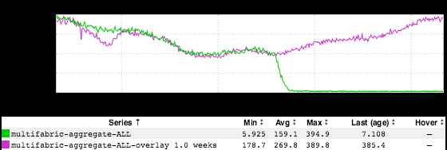
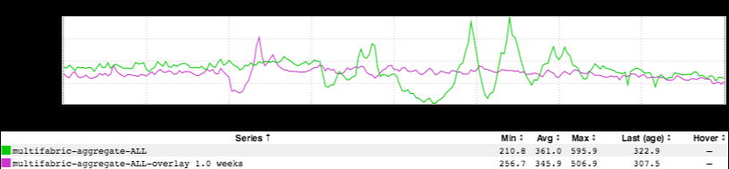
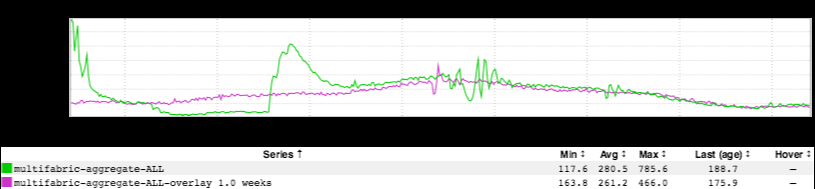

+++
title = "Ups & Downs"
date = "2018-06-07"
slug = "ups-downs"
draft = false
+++

Man. It's been A Week. It started off with my toilet flushing into my dining room (quite literally). I reckon here's what that looked like metaphorically:

...and then the plumber came out, re-seated the toilet, fixed the leak, and that looked kinda like:

All "Yay! No more shit dripping into the place where my family eats!", leveling off into something like normal. ...and then the rest of the week was kind of:

So on the whole, I reckon:

Huh. So, sometimes your dining room gets shit on...but on a long enough timeline, y'know what? Everything is Pretty Much Okay.

*Note: Each and every one of these inGraphs corresponds to a GCN from this week. Bonus points if you can guess which one.*
