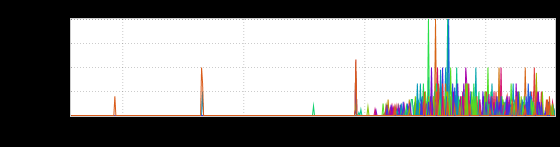
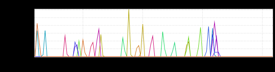

+++
title = "Break Fix"
date = "2018-06-15"
slug = "break-fix"
draft = false
+++

By way of apology for not posting on-time: I was laser-focused on tacos and tasty booze-drinks last night. It's summer, tacos are awesome, booze-drinks are awesome...and I just plain spaced. Anyhow, I have a bit of a sticky wicket I'd like to share. Fair warning: we haven't managed to unstick this particular wicket just yet, so to speak, so this may not be the most *satisfying* of posts. But I think it's at least *interesting*.

As a part of K2 we're working on leveraging Azure Load Balancers (ALBs) for distributing calls from lighthouse-frontend (LHFE) to a service running in Azure named k2-eg. LHFE is exhibiting intermittent timeouts on these calls. We don't see high latencies on the callee (k2-eg) side, and we've vetted out that it has something to do with the ALB by switching back and forth between leveraging the ALB and round-robin DNS (thanks to dns-discovery) to call k2- eg. Let's take a peek at what that looks like:

The "before" is using dns disco (which I'll call it from here on out, because it sounds more like a dance-dance party-party than its unabbreviated name) to round-robin requests out to k2-eg. The "after" is pointing at the ALB instead.

...and after reverting the change:

Hrm. So, the shortened timeline of this latter inGraph has probably made it a little more apparent: when I say "intermittent" I'm talking **really** intermittent (when looking at an individual node). The timeouts happen something on the order of once or twice an hour per instance. This makes it super-tricky to get data about why the timeouts are happening, because they're not reproducible in any kind of a reasonable timeframe.

As a hilarious aside: at one time they **were** reproducible in a reasonable timeframe (under a minute). I wrote a little script to reproduce:

#!/usr/bin/env python

import time import requests

URL='https://zwus2-k2applb-prod.azure.linkedin.com:5452/k2-eg/admin'

good_count=0 bad_count=0

while True: try: r = requests.get(URL, verify=False, timeout=10) good_count = good_count+1 print('[{}] {} {} (good count: {}, bad count: {})'.format(time.strftime('%x %X'), r.status_code, r.text. strip(), good_count, bad_count)) except: bad_count = bad_count+1 print('[{}] {} (good count: {}, bad count: {})'.format(time.strftime('%x %X'), 'ERROR', good_count, bad_count)) time.sleep(1)

Once Upon a Time this script would result in a timeout within 10-15 iterations of the main loop. Just today I ran it for 2 hours without a timeout occurring. So what changed? Well, we engaged someone from the MSFT side. Once we had someone actively engaged and looking at the problem my script stopped reliably reproducing the issue. Fucking classic.

What's the takeaway here? Well, here's the thing that I think is super-interesting: *sometimes in order to fix it you actually have to leave it broken.* We can't just deploy it on one node, or even a small handful of nodes; the time between failures is just too long to gain any meaningful signal without having a large enough footprint. We also have the advantage of this not being member-impacting - at present this particular feature is only ramped for shadow reads - but I've also been in situations where there   member impact, and in the name of diagnosing & fixing the problem on any kind of reasonable timeline the only **is** way is to leave it broken temporarily.

Now, to set your mind at ease that I'm not leaving your site fucked up over the weekend: we've found another way to gain signal here. Another service that is also leveraging the ALB is exhibiting similar timeouts. This particular service happens to handle these timeouts in a way that is more graceful, doesn't break shadow reads, and doesn't trigger alerts.

Happy Friday and Happy inDay, folks!

