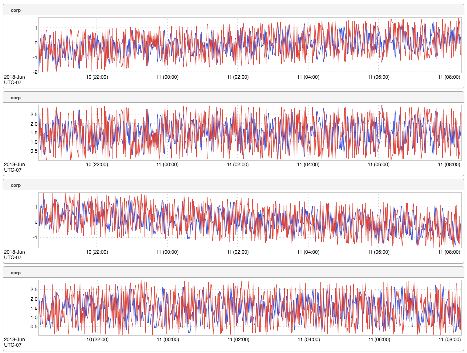
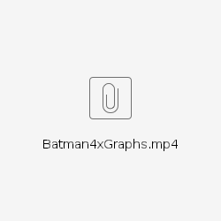
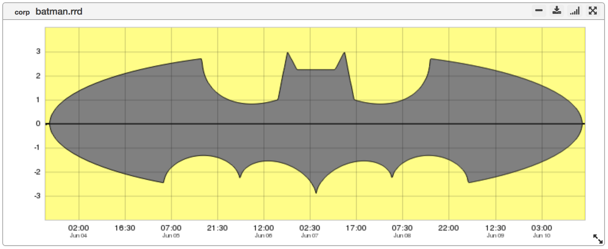
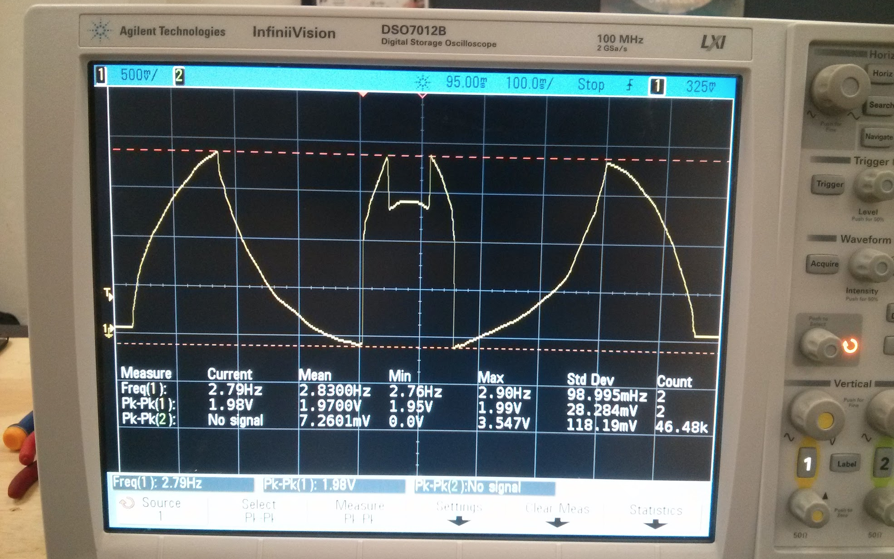

+++
title = "Intentional Art"
date = "2018-06-21"
slug = "intentional-art"
draft = false
+++

*[This week's post is yet another contribution by Chris Carini* *Intentional Art* *(**). Enjoy...and thanks, Chris!* *]*

_The What_ _The Why_

The What

_Cliff Snyder_ gets a lot of awesome submissions from folks where inGraphs displays something that looks like art, unintentionally. _Cliff Snyder_ appropriately _titles them "Unintentional Art", and to-date, there have been 19 such posts over the nearly 2.5 years IGOTW has been going!_

Every time I see one of the UA posts, I think "It'd be pretty neat if some of these were ***intentional***". Today, I'm here with **Intentional Art.**

I present to you, Intentional Art!

"Wtf, this doesn't really look like art, Chris..."

Let's zoom out a little...

"Hmm, ok, so something funky started changing...wait, what the hell is that?! Is that..."

Yup.

Batman.

Hidden  somewhere in inGraphs, is the [1][bat-signal](https://en.wikipedia.org/wiki/Bat-Signal). Intentionally. Hence, Intentional Art.

The Why

_Early in my career at LinkedIn, my teammate Nishan_ and myself discovered that our other teammate, [Anurag](https://www.linkedin.com/in/anuragrb/) (LinkedIn profile), was a huge fan of Batman. Since team culture has always been very important to me, and our team had a pretty good sense of humor, I thought "Wouldn't it be funny if we were to trigger an AutoAlert to Anurag with the bat symbol?"

Something like...

You know... with an accompanying phone call from voicenotifier saying "Gotham needs you!".

"Of course!", Nish said. So I thought this would make for one fun side-project.

Unfortunately, being a side-project, this got deployed ~10 months too late - Anurag has since moved on to his next play. But I figured the sheer entertainment and 'fun' value of this meant it was still worth it - so I figured I'd whip something nifty up.

_Cliff Snyder_ said in the original UA post, "I love it when inGraphs unintentionally produces something that looks like an art piece." I just had this itch to draw something neat, ***intentionally***.

_p.s. This isn't the first "Intentional Art" that has made it to IGOTW. In late December 2016, Ben Weir_ used some _progra-magic to have inGraphs display _ _"Merry X-Mas and Happy New Year!". It's words, but it's also art._

p.p.s. From the beginning, I knew that "drawing" this in inGraphs was entirely possible. Back in my college days, the IEEE chapter at my university would have an oscilloscope display part of the bat symbol at our table during freshman orientation - this usually got folks (students and parents alike) interested enough to stop by and ask "How *did* you do that?!".

*(****Note:*** *personal photo, all rights reserved)*

***References:***

*[1]* *= Hidden, because I intentionally didn't want to make this obvious when looking at the graph in inGraphs. I made use of some of the less commonly* *used (based on my knowledge) inGraphs dashboard settings* *in order to get the bat-symbol to display all fancy (black and yellow, etc). If you are so* *inclined to do some investigation and figure out how I got from 4 metrics to a single graph displaying the bat-symbol, you'll win a (lame) prize. After all, part*

*of the fun of being a SRE is the investigative work you get to do once in a while!*
