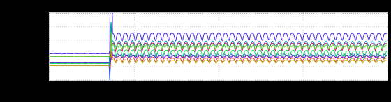

+++
title = "Happy 4th of July!"
date = "2018-07-04"
slug = "happy-4th-of-july"
draft = false
+++

I poked around some of the inGraphs in my backlog today looking for something patriotic - not for *too* long, mind you (DTO and all that). Here's what I came up with:

This little gem (provided by _Matt Knecht - thanks, Matt!) both looks pretty rad _*and* can be interpreted as looking like a flag waving in the breeze. (Bonus exercise for the reader: if you fiddle around with the color palette and stacking you can *also* [make it look like nyan cat! Click here if you feel like playing ](https://ingraphs.prod.linkedin.com/dashboard/obhc-server-runtime/graph/%5BRUNTIME%5D%5BALERT%5D%20NumGoroutine?auto_refresh=1&fabric_groups=ei&upper_limit=3000&use_time_selector&start_time=1530126000000&end_time=1530169200000) around with it.)

Happy 4th of July, folks.
