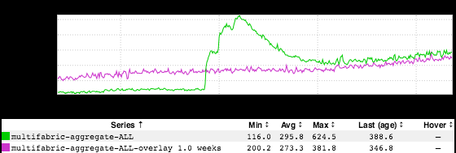

+++
title = "Family Vacation"
date = "2018-07-13"
slug = "family-vacation"
draft = false
+++

I'm coming off a week of post-shutdown DTO at the beach. I was combing through my inGraph screenshot backlog a bit trying to find something to post and I came across this lil guy:

**What it actually is:** Something Happened that impacted member-to-member (M2M) invitations. It happened around a month ago. I spent about half of the time since it happened on DTO, so I'm a little fuzzy recalling exactly what it was. I think mebbe something with Espresso replication? Hrm...cobwebs. Ah, well...I'm sure it'll come to me on Monday.

**How I choose to interpret it:** I spent this particular bit of DTO on the beach in Ocean City, MD. The green - current-week - is a wave in the Atlantic ocean. The magenta? Yeah, that would be my sunburn, the color of which I'd classify as "Angry Mauve".

Happy Summer, folks!
