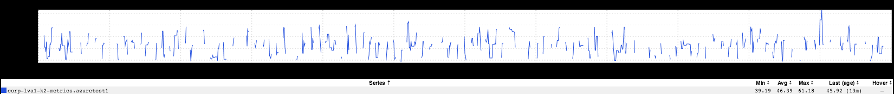
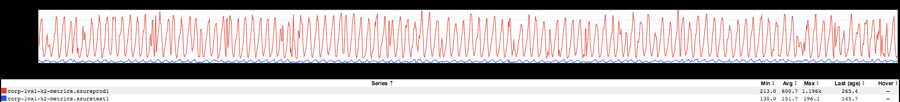
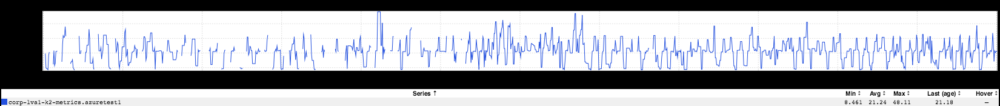
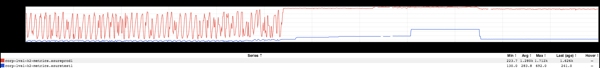
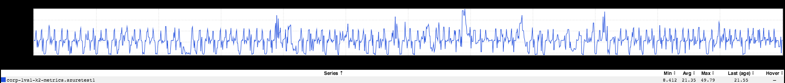
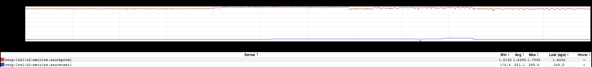

+++
title = "Gaps"
date = "2018-07-20"
slug = "gaps"
draft = false
+++

[I posted about an improvement to azmon a while back, and I thought this week I'd go share another one that I think is interesting. A tl;dr refresher on what ](/igotw/2018-05-03-steps-to-improvement/) azmon is: a python multiproduct for gathering Azure resource metrics from Azure's monitoring API and re-emitting them into autometrics so we can visualize/alert on them in inGraphs. Let's take a peek at what needed improvement:

Per the graph title, this is an inGraph of average % CPU used for a particular VM running in Azure. It leaves a little to be desired; specifically, look at all the gaps in the data. Not so great. For a bit of a clue as to what's going on here:

This is an inGraph of a meta-metric that azmon emits representing the total number of metrics collected in a given minute. As you can see, it's kinda all over the place. So...what's going on here? Well, I did a little testing, and it turns out that azmon was receiving null values from Azure's monitoring API fairly frequently (which it does not emit into autometrics, for reasons that are hopefully obvious). This is purely conjecture on my part, but I think what might be happening is the Azure API might be favoring consistency over availability, so to speak. To clarify: I think if the API isn't confident that it's received all of the data points for a particular minute - perhaps that minute's reporting window hasn't "closed", or it's still working on computing aggregations, or what-have- you - then it prefers to return null instead of a partial result. azmon was requesting data points for "the minute leading up to *now*", so sometimes we'd "get lucky" and get a result...and sometimes we'd get a null value, instead.

To vet this out, I tried changing this bit of code:

**Before**

now = datetime.datetime.utcnow() then = now - datetime.timedelta(minutes=1)

...to this:

**After**

now = datetime.datetime.utcnow() - datetime.timedelta(minutes=1)  # previous minute then = now - datetime.timedelta(minutes=1)

Instead of requesting the current minute's data (which had high likelihood of not yet being available at the time of the request), I started grabbing the previous minute's value. Was this effective? Well, let's see if you can tell me at what time I deployed this change.

Starting to look a little better, no? To underline this, let's swing back to the metrics_emitted meta-metric:

...and for completeness, what this looks like for a 24-hour period after having been deployed:

Nifty!

If you'd like to play with these metrics yourself, here are a couple of links:

[https://ingraphs.prod.linkedin.com/container/azmon/graph/azmon/westus2.vm.zwus2-00001.Percentage_CPU.percent.average.rrd?fabric_groups=corp](https://ingraphs.prod.linkedin.com/container/azmon/graph/azmon/westus2.vm.zwus2-00001.Percentage_CPU.percent.average.rrd?fabric_groups=corp)

[https://ingraphs.prod.linkedin.com/container/azmon/graph/azmon/metrics_emitted.totalCount.rrd?fabric_groups=corp](https://ingraphs.prod.linkedin.com/container/azmon/graph/azmon/metrics_emitted.totalCount.rrd?fabric_groups=corp)
