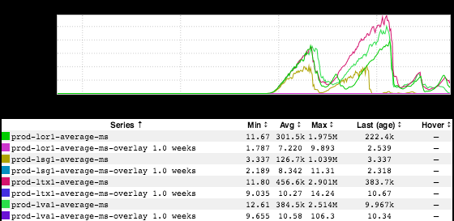
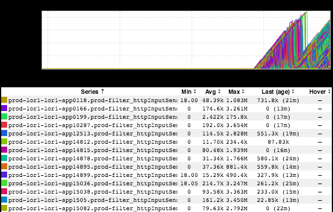
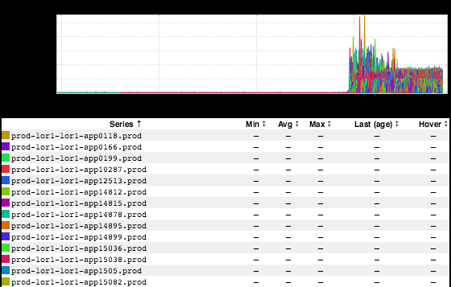
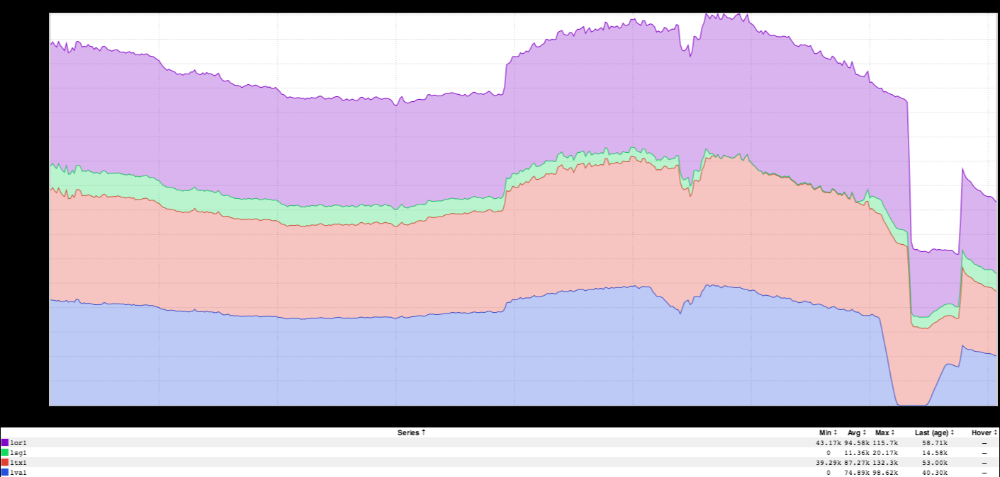

+++
title = "Tracking"
date = "2018-08-02"
slug = "tracking"
draft = false
+++

The frequent igotw reader will know that GCNs are often an excellent source of interesting inGraphs. Yesterday's mobile-tracking-frontend GCN ([GCN-](https://jira01.corp.linkedin.com:8443/browse/GCN-27108) [27108](https://jira01.corp.linkedin.com:8443/browse/GCN-27108)) was no exception. What happened? Per the ticket:

*"a tracking event was added in Callisto without the schema being registered. tracking frontend has the ability to do dynamic topic whitelisting and* *while trying to add that topic it failed to get the schema and spiraled out of control"*

Just how "out of control" did it spiral? Well, let's take a look:

Upward of 29M ms of latency (averaged across hosts)? I suppose that qualifies as "out of control". What it looks like without the averaging:

Over 4M ms! "...and it's a Java app, so I'll bet there's an associated GC graph..." You'd win that bet:

"Surely this was limited to like a single fabric or something though, right? To the untrained eye it's not obvious that the impact was global..." Welp...that wager is decidedly less safe. Here's what (global) inbound QPS to the service looked like during the incident:

Yeesh. This failure also started to impact ATS, which was starting to have an impact on the rest of the site. In order to stabilize the service (which was continuously falling over after restart) and in order to protect the Traffic layer the anti-abuse team was engaged to put a block filter in place, effectively black-holing all inbound traffic coming to this service. Now, I don't have an inGraph of the specific impact to L0/L1...but what I **do** have is this awesome graph of overall main partition traffic before/after the block that was pointed out to me by _Robert Borkowski_ (thanks, Robert!)

The obvious dropoff and subsequent rebound is traffic for the duration of time that the block was in place. It may not be super-clear from the screenshot - if [you want to play around with it so you can hover and see actual values click here - but the interesting thing that this inGraph would seem to indicate: ](http://ingraphs.prod.linkedin.com/dashboard/gbanks-traffic-shift/graph/main%20partition%20QPS%20per%20fabric?fabric_groups=prod&auto_refresh=1&width=1331&height=557&use_time_selector&start_time=1533146400000&end_time=1533168000000)*trackin* *g accounts for roughly half of all inbound main partition traffic to the site!* This is surprising...but perhaps not **too** surprising. In the vein of "[What gets ](https://en.wikipedia.org/wiki/Peter_Drucker) [measured gets done" (or, if you prefer, "](https://en.wikipedia.org/wiki/Peter_Drucker)[What gets measured gets fixed](https://engineering.linkedin.com/blog/2016/12/what-gets-measured-gets-fixed)") I suppose it stands to reason that we'd dedicate at least as many resources to tracking as we do to serving actual site traffic.
