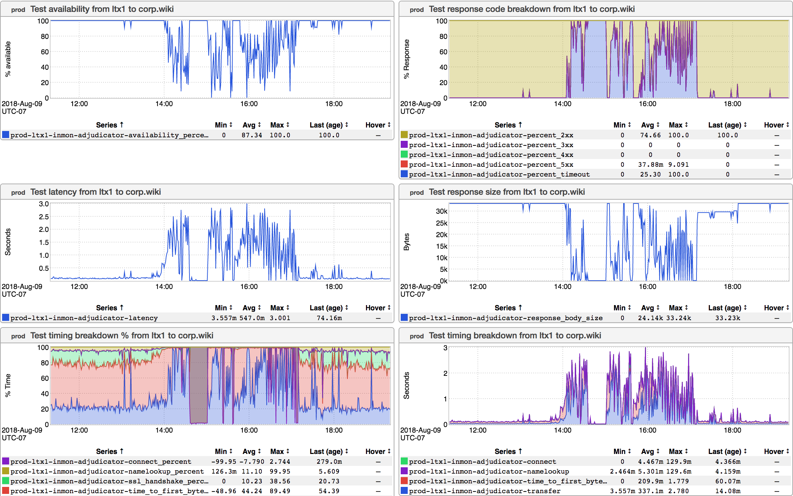

+++
title = "Go Links"
date = "2018-08-09"
slug = "go-links"
draft = false
+++

Earlier today I was prepping to write a post I've been thinking about for a couple of weeks now. ...and then [Confluence decided to shit the bed](https://jira01.corp.linkedin.com:8443/browse/GCN-27186). That got me thinking about *go links that answer a question*, so I decided to defer the post I was going to write for yet another week (teaser: it had to do with load balancing) and post about something else entirely.

Unless this is your first day at LinkedIn it's very likely that you know what a "go link" is. If this   your first day: we have an internal link-shortening service. **is** _Anyone can use it and its interface is dead-simple. If you want to create your own go link you can do so at http://go/go. So gogo forth and shortlink to your _ heart's content. (As an aside: if this happens to be your first day then you're probably going to want to keep _go/jargon in mind. There are other helpful links _ for FNGs...this may be one of the most-helpful.)

[Anyhow, in the vein of http://hasthelargehadroncolliderdestroyedtheworldyet.com/](http://hasthelargehadroncolliderdestroyedtheworldyet.com/) there are go links that provide answers to questions. To wit: _go_ _/iswikidown. Let's take a peek:_

Oof. I suppose it doesn't have quite the clarity of the LHC link above, but I reckon I'd say the answer to the question "Is wiki down?" is "Decidedly, yes."

A few other favorites:

_go/islinkedindown_

_go/iscrtdown_

_go/isjiradown_

I'll leave it as an exercise for the reader to replace the X in go/isXdown and see whether or not someone has created a dashboard and associated go link

for it. ...and just for funsies: maybe try replacing "down" with "up".
