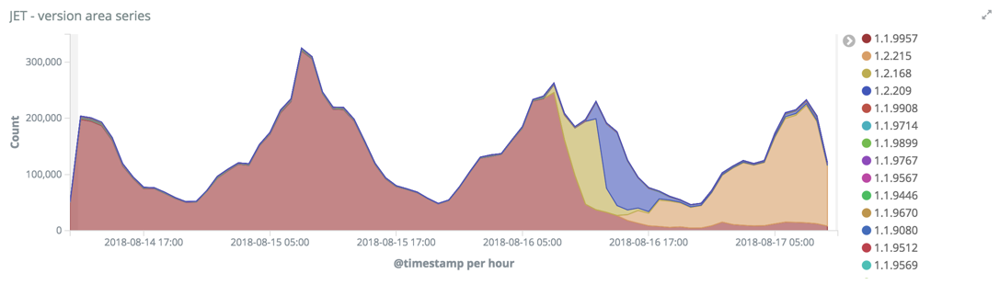
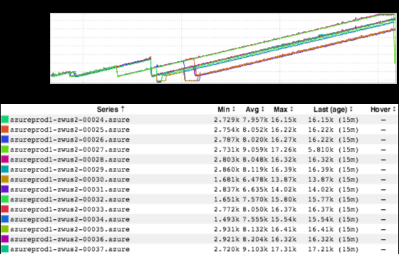
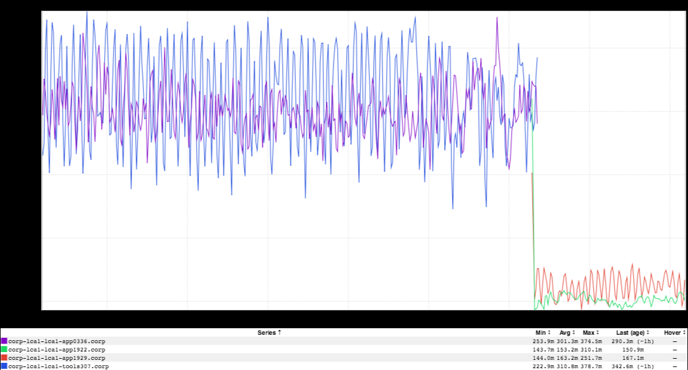
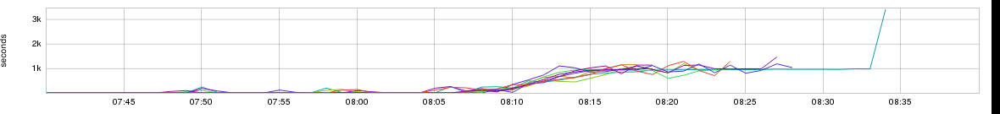
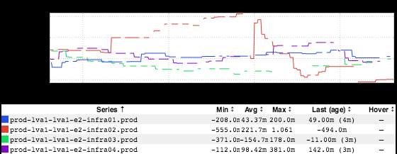

+++
title = "Unintentional Art (SRE[in]con)"
date = "2018-08-17"
slug = "unintentional-art-sre-in-con"
draft = false
+++

*[Note: This post has nothing at all to do with incon other than mentioning it, but Confluence* ***apparently*** *no longer allows posts with duplicate titles (despite* *the fact that I have a dozen or so prior posts with the UA title). So I had to find something else to put in there to make it unique...]*

_After a long week (including another successful SRE[in]con) I'm pretty wiped out, so let's just take a look at a few recent bits of UA. First up: thanks to __Alexs_ _andra McMahan_, a nifty little _JET graph that helps visualize the versions of voyager-web in prod:_

[Next, yet another inGraph that is reminiscent of Hulk Hogan](/igotw/2016-05-19-unintentional-art/):

Third, a nifty little inGraph of latency improvement that _Anthony Gargiulo shot my way earlier today:_

Fourth, an inGraph that I **believe** came from a _DS3 update some time this week. If memory serves it's a graph of GC durations. The thing that caught my _ eye on this one: is the unit **really** seconds? I kinda doubt it. ...but it looks cool all the same:

...and finally, an NTP drift inGraph that I've been staring at for the past 5 minutes straight...

Happy Friday, folks!
