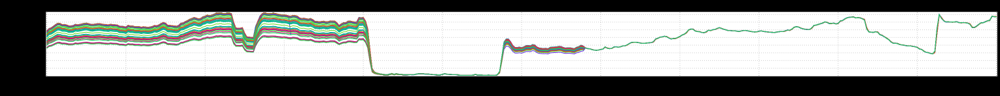

+++
title = "Convergence"
date = "2018-08-23"
slug = "convergence"
draft = false
+++

I've posted about load balancing a handful of times in the past. Sometimes the post is about a _break-fix. Sometimes it's an algorithm that perhaps _[doesn't ](/igotw/2016-11-10-load-un-balancing/) [balance load as well as one might hope. Sometimes it ](/igotw/2016-11-10-load-un-balancing/)[just plain looks cool. This time? Welp...I'd say this time it's a tale of triumph. Feast your eyes on this:](/igotw/2018-05-31-unintentional-art/)

Breathtaking.

Once you're done marveling at this beaut' (go ahead and take another look...don't worry, I'll wait) you might be wondering what happened? Well, D2 recently introduced a new load balancing algorithm called "distributionBased", and based on the above it would appear that this algorithm beating it's predecessor (multiProbe) pretty soundly in terms of even distribution.

Now, there *are* some caveats - for example, "distributionBased algorithm DOES NOT support sticky routing" - but if that nice, tight distribution toward the _right is making your mouth water then you might consider taking a look at this D2 User Manual wiki to see whether it's a good fit for your service._

Happy hashing, folks!

Oh, and if you're interested in playing around with this graph a bit: [http://ingraphs.prod.linkedin.com/tag/ROUTER_IDENTITY/?fabrics=prod-](http://ingraphs.prod.linkedin.com/tag/ROUTER_IDENTITY/?fabrics=prod-lva1&fabrics=prod-lsg1&fabrics=prod-lor1&fabrics=prod-ltx1&timezone=US%2FPacific&filter=identity_(Read)calltracker.*callcounttotal&width=1448&use_time_selector&start_time=1531206000000&end_time=1531335600000&legend=false) [lva1&fabrics=prod-lsg1&fabrics=prod-lor1&fabrics=prod-ltx1&timezone=US%2FPacific&filter=identity_(Read)calltracker.](http://ingraphs.prod.linkedin.com/tag/ROUTER_IDENTITY/?fabrics=prod-lva1&fabrics=prod-lsg1&fabrics=prod-lor1&fabrics=prod-ltx1&timezone=US%2FPacific&filter=identity_(Read)calltracker.*callcounttotal&width=1448&use_time_selector&start_time=1531206000000&end_time=1531335600000&legend=false) [*callcounttotal&width=1448&use_time_selector&start_time=1531206000000&end_time=1531335600000&legend=false](http://ingraphs.prod.linkedin.com/tag/ROUTER_IDENTITY/?fabrics=prod-lva1&fabrics=prod-lsg1&fabrics=prod-lor1&fabrics=prod-ltx1&timezone=US%2FPacific&filter=identity_(Read)calltracker.*callcounttotal&width=1448&use_time_selector&start_time=1531206000000&end_time=1531335600000&legend=false)
