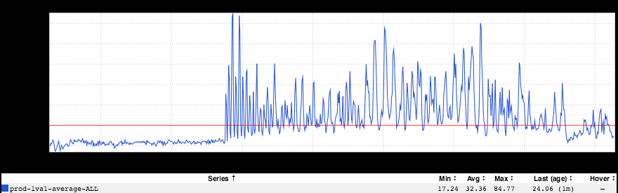
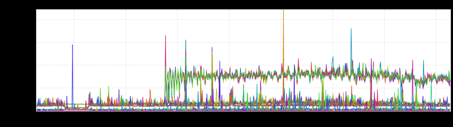
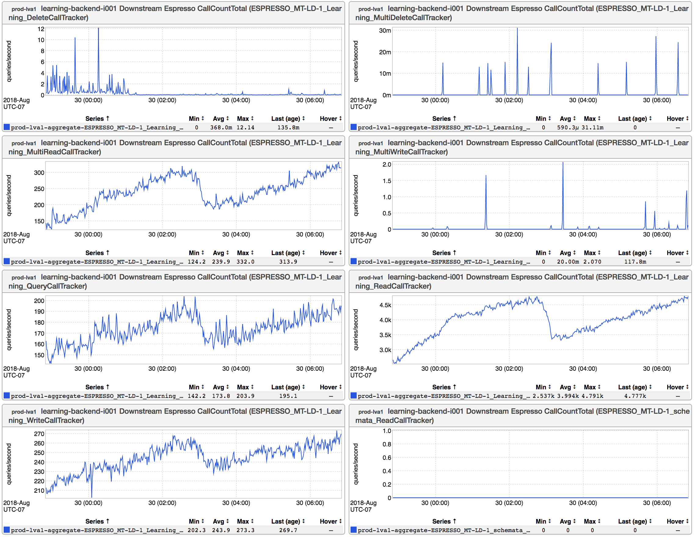
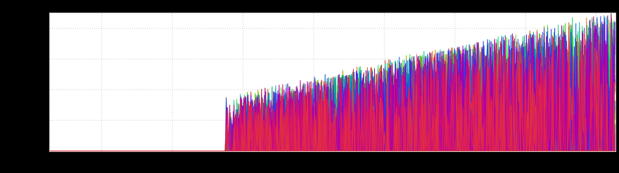
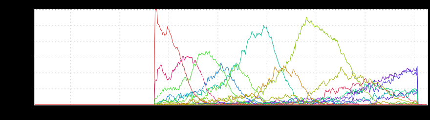
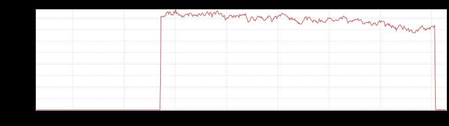

+++
title = "Espresso Triage"
date = "2018-08-30"
slug = "espresso-triage"
draft = false
+++

This week I've got a series of inGraphs and a little "color" provided by _Nick Brown. These inGraphs are especially timely in light of __Greg Banks_' recent SRE [in]con talk on [triaging Espresso problems - in fact, the very first question I asked was "did you find this because you went to the espresso triage talk at ](https://linkedin.hosted.panopto.com/Panopto/Pages/Viewer.aspx?id=d68a29c7-8960-4c82-88bc-a944010b2e58) incon". So...let's dive right in:

*Raised to learning-sre from invisualize* [[link]](http://ingraphs.prod.linkedin.com/dashboard/ivupstream-espresso-router-30/graph/invisualize%20UPSTREAM-LATENCY%20learning-backend%20to%20ESPRESSO%20Learning_WriteCallTracker%20on%20espresso-router?fabrics=prod-lva1&overlay_amount=0&overlay_unit=hours&multifabric=false&timezone=US%2FPacific&threshold=None&use_time_selector&width=800&height=200&start_time=1533595800000&end_time=1533682200000)

*Found via *espresso-client-triage* dynamic dashboard (useful!)*[ [link]](https://ingraphs.prod.linkedin.com/container/learning-backend/graph/99th%20Percentile%20Latency%20from%20Service%20learning-backend%20Instance%20i001%20to%20Espresso%20Cluster%20MT-LD-1%20Database%20Learning?dynamic=espresso-client-triage&fabrics=prod-lva1&use_time_selector&informed_topics=siteops&informed_sources=LIX&informed_keywords=&consolidate=None&width=800&height=200&end_time=1533682200000&start_time=1533595800000)

[*But no significant change in call pattern (less interesting graphs)* ](https://ingraphs.prod.linkedin.com/container/learning-backend/?fabrics=prod-lva1&dynamic=downstream-qps&overlay_amount=0&overlay_unit=hours&filter=spresso.*Write&use_time_selector&start_time=1533595860000&end_time=1533682260000)[[link]](https://ingraphs.prod.linkedin.com/container/learning-backend/?fabrics=prod-lva1&dynamic=downstream-qps&overlay_amount=0&overlay_unit=hours&filter=spresso.*Write&use_time_selector&start_time=1533595860000&end_time=1533682260000)

*With help of espresso sre, we found a Kafka thing* [[link]](https://ingraphs.prod.linkedin.com/dashboard/espresso-storage-node-diagnostic/graph/ESPRESSO_MT-LD-1%20-%20Kafka%20-%20Consumer%20Peak%20Max%20E2E%20Commit%20Latency?fabrics=prod-lva1&overlay_amount=0&overlay_unit=hours&filter=&use_time_selector&end_time=1533682140000&start_time=1533595740000)

[*Which turned out to be a shard balancing issue with the Espresso cluster, since they added a new storage node* ](https://ingraphs.prod.linkedin.com/dashboard/espresso-storage-node-diagnostic/graph/FAILURE:%20ESPRESSO_MT-LD-1%20DifferenceWithIdealState%20Partitions?fabrics=prod-lva1&overlay_amount=0&overlay_unit=hours&filter=FAILURE.*MT-LD-1&use_time_selector&start_time=1533595740000&end_time=1533682140000)[[link]](https://ingraphs.prod.linkedin.com/dashboard/espresso-storage-node-diagnostic/graph/FAILURE:%20ESPRESSO_MT-LD-1%20DifferenceWithIdealState%20Partitions?fabrics=prod-lva1&overlay_amount=0&overlay_unit=hours&filter=FAILURE.*MT-LD-1&use_time_selector&start_time=1533595740000&end_time=1533682140000)

[*Which aggregates down to this:* ](https://ingraphs.prod.linkedin.com/dashboard/espresso-storage-node-diagnostic/graph/FAILURE:%20ESPRESSO_MT-LD-1%20DifferenceWithIdealState%20Partitions?fabrics=prod-lva1&filter=LD-1&consolidate=AggregateAll&use_time_selector&start_time=1533595920000&end_time=1533682320000)[[link]](https://ingraphs.prod.linkedin.com/dashboard/espresso-storage-node-diagnostic/graph/FAILURE:%20ESPRESSO_MT-LD-1%20DifferenceWithIdealState%20Partitions?fabrics=prod-lva1&filter=LD-1&consolidate=AggregateAll&use_time_selector&start_time=1533595920000&end_time=1533682320000)

Very cool stuff - in particular, the kafka inGraph is quite striking - and a good practical example of how to use the espresso-client-triage dynamic dashboard to get a better picture of what's going on (*before* escalating to espresso-sre). If you'd like to give it a shot for your service, copy-paste the following link:

[http://ingraphs.prod.linkedin.com/container/SERVICENAME/?dynamic=espresso-client-triage](http://ingraphs.prod.linkedin.com/container/SERVICENAME/?dynamic=espresso-client-triage)

...and replace *SERVICENAME* with...well...with the name of your service.
