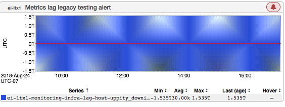
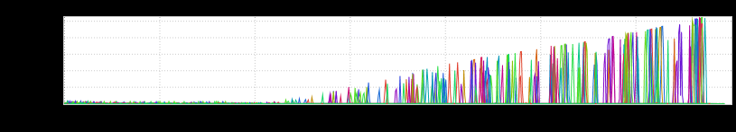
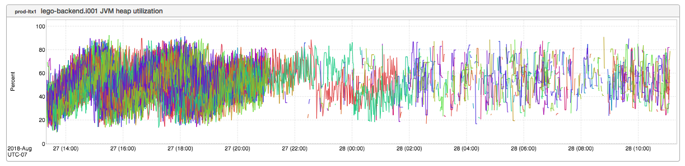
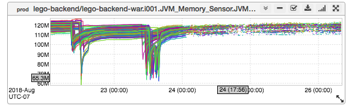
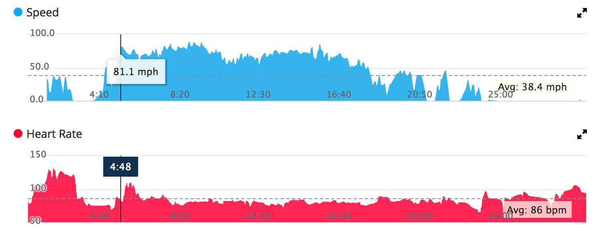
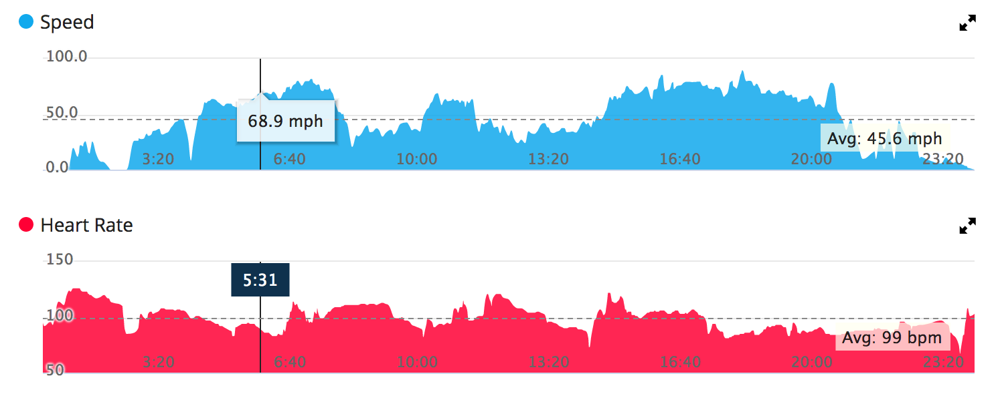

+++
title = "Unintentional Art (September 2018)"
date = "2018-09-06"
slug = "unintentional-art-september-2018"
draft = false
+++

Let's take a look at a few bits 'n' bobs I've picked up along the way. This first one from _Jayesh Lahori is a great example of the _[moiré effect](https://en.wikipedia.org/wiki/Moir%C3%A9_pattern) (oblig [xkcd](https://xkcd.com/1814/)):

One might look at this and ask "Why is it alerting?" Maybe it's because there were just too damn many "uppity_downis"? I mean, like, *more than a trillion of* *them*! I don't know what they are, but that seems like more than anyone could possibly need or want.

Next up is a series of inGraphs that _Nick Clifford came across while troubleshooting a problem. I'm not sure what the actual root cause was, but the _ symptoms looked like metrics tracking events growing unbounded over time:

...which subsequently led to metrics just kind of disappearing:

...in some cases to most excellent visual effect. This one in particular makes me think of [Neal DeGrasse Tyson describing ](https://www.youtube.com/watch?v=h1iJXOUMJpg)[spaghettification](https://en.wikipedia.org/wiki/Spaghettification):

Finally, I've got a couple of interesting charts that are *not* _inGraphs. The below are some graphs that Sean Higdon__ posted in #motorcycles (thanks to Jim _ _Ockers for pointing these out to me). The blue represents speed, the red represents heart rate. (Yes, I know there's a legend, I just wanna make it clear _ what we're looking at here.)

This is data collected on Sean's commute with little to no lane-splitting:

...and this is what it looks like *with* lane-splitting:

Higher average speed, sure...but look at that heart rate! Very cool data.
