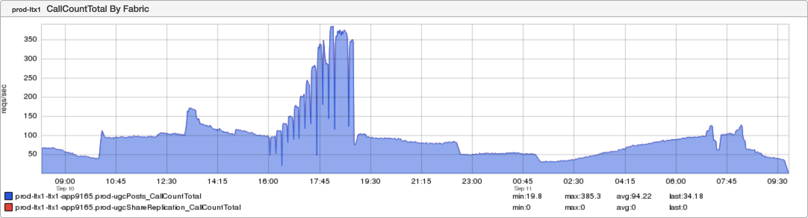

+++
title = "Redliner"
date = "2018-09-13"
slug = "redliner"
draft = false
+++

For those of you who don't know what _redliner_ is, it's a tool for estimating the maximum per-node QPS that a given service can handle using empirical evidence. The fuck does that mean? Well, here's how it works:

1. Redliner selects one node providing the service you want to "redline"

2. Redliner gradually increases the percentage of overall traffic that goes to that particular node

3. After each increase, redliner evaluates the relative health of the service on that node

4. When the health of the service being provided by that node has crossed some threshold, redliner resets to "normal" and emits a result

This result takes the form of a "redline number" - the maximum amount of per-node QPS that redliner thinks a service can handle before it starts to degrade.

_Let's take a look at what this looks like with an inGraph (courtesy of Jim Ockers):_

The step-function increases in QPS - and the subsequent return to "normalcy" - show up pretty clearly. Pretty rad, right?

An open question: Something I'm not sure I grok at present is the dips between increases. Maybe redliner has some kind of a temporary backoff between weight increases? Or maybe it's some implementation detail that introduces time lag between increases? Hell, maybe it's a bug? I'm not sure...but if anyone knows I'd love to understand it.
