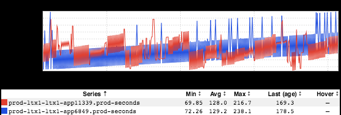

+++
title = "On Observability"
date = "2018-09-20"
slug = "on-observability"
draft = false
+++

Over the past couple of years I've seen a handful of talks and read a number of...err...reads relating to Observability. As a concept, Observability makes my mouth water. Yes, I want it. Yes, I want to be able to understand precisely what's going on with the systems I support. Yes, I want everyone around me [- everyone I work with - every engineer I come in contact with - to have that same ability to deeply grok What's Hatnin'. My God...I want that](https://www.youtube.com/watch?v=0mfSfekiZeE).

Coupla things, though.

First off, each and every one of these talks/reads come off as "pie-in-the-sky". What I mean is: I Get It conceptually, but there isn't a whole lot to go on in practical terms. I think this has a lot to do with the concept (of Observability) being well ahead of the state-of-the-art in terms of generally-available frameworks/tooling ...but that doesn't make it any less frustrating to hear folks get up on stage and talk about it with the hand-waviest of hand-waves.

...and I'm actually okay with that part. It's frustrating...but frustrating in the sense of "I want everything to be Completely Awesome, Right Now." Flying cars. Robot assistants. The Year of the Linux Desktop. In order for progress to be made, folks need to start talking about it. Talking about it publicly. Exploring the space and driving the message. I understand that.

The frustrating part for me (and why I bring it up here): it tends to be accompanied by a general disdain for dashboards. For graphs. For "traditional" metrics. A part of the message seems to be "Observability is what you really want, so you should throw away all your dashboards because they're Bad and you should feel Bad." <sigh> I'm trying not to be too much of a "homer" here - lol the entirety of igotw is about dashboards and graphs and "traditional" metrics - but I feel like there's room for both.

Car analogies kind of suck, but I'm going to use one anyway. Chances are whatever car you drive - or whatever car you've been in most recently, if you don't drive - has a computer in it. When something in the car breaks it's likely that that requires a separate computer in order to diagnose that car's computer. This diagnostic computer is rarely seen outside of a mechanic's shop; it simply doesn't make economic sense for a consumer to own one. This Mechanic's Computer provides Observability in that you hook the fucker up to the car's computer and it tells you what's wrong with the car. I'm not a Car Guy so I don't know exactly what it says, but that's the gist.

But...does that mean you should throw away your gas gauge? Your speedometer? Your tachometer and oil pressure gauge? (haha How many cars actually have tachs or any kind of gauge to do with oil nowadays?) Should all gauges be done away with because they don't give the same degree of Observability as the Mechanic's Computer? Is it worthless if it doesn't tell you exactly what's going on under the hood?

Anyhow...that's a whole lotta talky-talk. Let's take a look at an inGraph, shall we?

[It's like a visual demonstration of an ascending Shepard tone. I don't know what it means, but it's lovely.](https://en.wikipedia.org/wiki/Shepard_tone)

And, I suppose, oblig: From my cold dead hands.
