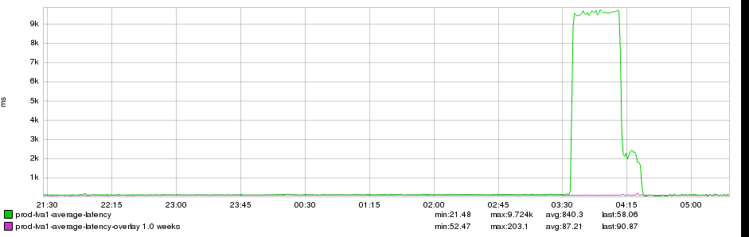
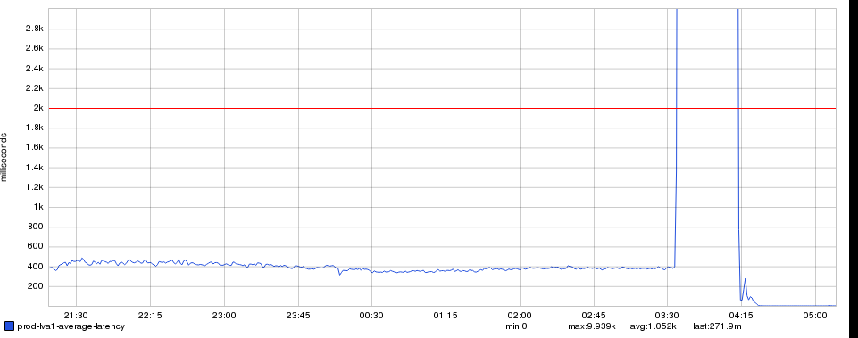
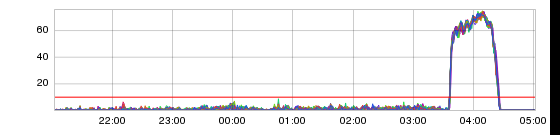
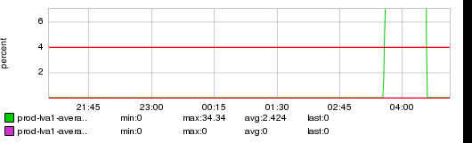
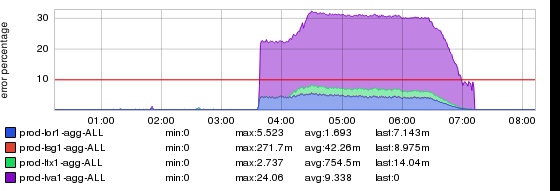
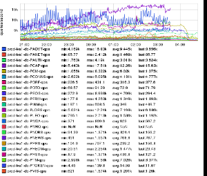
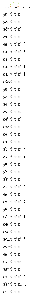
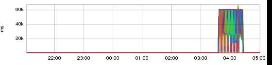

+++
title = "Cornucopia"
date = "2018-09-27"
slug = "cornucopia"
draft = false
+++

This week was a veritable [Horn of Plenty](https://en.wikipedia.org/wiki/Cornucopia) for interesting inGraphs. There were 3 Major GCNs at this morning's _DS3 alone, and while not every igotw is _ about an incident the frequent reader will grok that GCNs are a consistent source of rad inGraphs. There was one incident in particular this week that stood out: [GCN-27616.](https://jira01.corp.linkedin.com:8443/browse/GCN-27616)

I have to admit, upon initially seeing this GCN my gut reaction was that maybe it was an exercise in efficiency. That is to say, perhaps the agenda was "Let's crash all the databases at once and get it out of the way for the quarter." The list of databases impacted:

**PCAP, PADVT, PAMBRY, PCONNS, PDRF, PFRM, PINM, PJOBS, PKMS, PNEWS, PTM, PTM2, PTOKEN, PVIS**

Oof. What does that look like in terms of service impact? Well, the ticket does not disappoint. There are no fewer than 18 inGraphs linked. I'm not going to post them all, but I *am* going to post a handful. ...and not just because "Hey, here's a pile of content for me to use." The thing that's interesting to me about the linked inGraphs taken as a collection: it gives an interesting window into how people thought about the problem as it was happening - what they were looking at, and how they were looking at it. None of them are "wrong", they're all just different facets of the problem space. Let's take a ride, shall we?

[Some folks chose to look at it in terms of latency:](http://ingraphs.prod.linkedin.com/snapshot/1_20180927_122731/)

[...and some looked at it in terms of latency, but with an upper bound. "Who cares what the max was, it was above ](http://ingraphs.prod.linkedin.com/snapshot/1_20180927_121306/)[*my* ](http://ingraphs.prod.linkedin.com/snapshot/1_20180927_121306/)[threshold":](http://ingraphs.prod.linkedin.com/snapshot/1_20180927_121306/)

[Similarly, some folks looked at it in terms of the percentage of 5xx responses returned by the service:](http://ingraphs.prod.linkedin.com/snapshot/1_20180927_120255/)

[...and some looked at the percentage of 5xx responses, but with an upper bound:](http://ingraphs.prod.linkedin.com/snapshot/1_20180927_115731/)

[Some looked at it in terms of inbound error rate to their service:](http://ingraphs.prod.linkedin.com/snapshot/pint_20180927_151326/)

[Some looked at it in terms of incoming QPS to the databases, which of course dropped off suddenly for the impacted ones:](https://ingraphs.prod.linkedin.com/snapshot/1_20180927_114846/)

[Anyhow, if I had to pick a favorite it might be this one:](http://ingraphs.prod.linkedin.com/snapshot/1_20180927_120241/)

_In addition to being an excellent demonstration of the Plateau_ pattern (and, presumably, a 60 second timeout) it's Just Plain Lovely.
