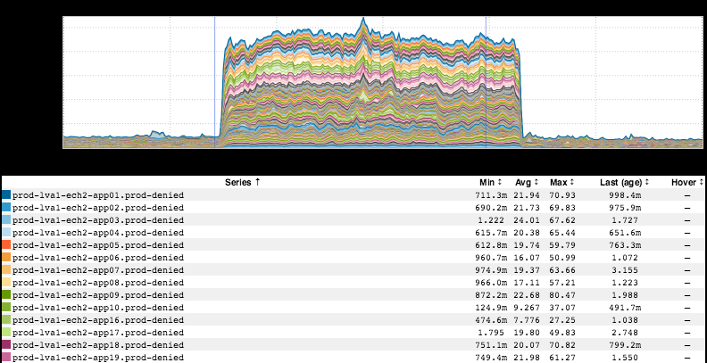
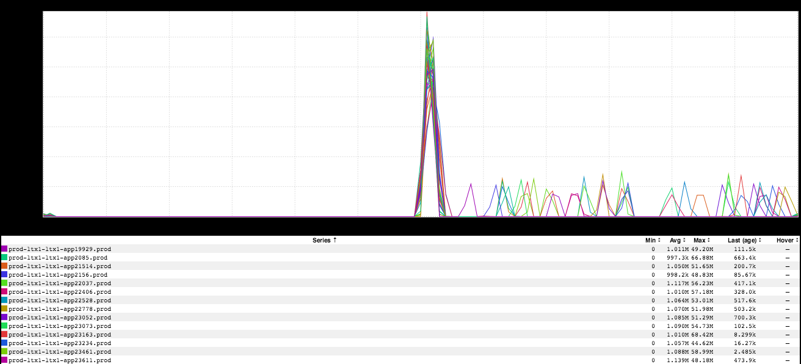
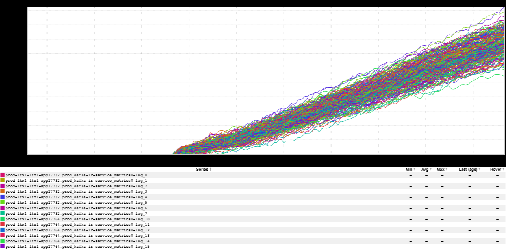
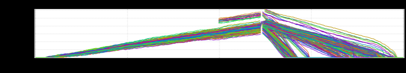

+++
title = "Unintentional Art (Chili Cookoff"
date = "2018-10-04"
slug = "unintentional-art-chili-cookoff-edition"
draft = false
+++

**Edition)**

Hopefully most of the folks reading this are at the [2018 Chili Cookoff today. I'm super-bummed I couldn't make it this year - it's my favorite annual LinkedIn ](https://splashthat.com/sites/view/southbaycookoff.splashthat.com)

event - but I hope y'all are having fun.

[At any rate, let's take a peek at a handful of inGraphs, shall we? First up: a nifty little inGraph-cake from a recent GCN](https://jira01.corp.linkedin.com:8443/browse/GCN-27649):

In addition to being a good demonstration of the informed overlay (note the two faint blue lines representing the lix activation that caused the GCN and the subsequent termination that resolved it.) I like this lil fella because it's a good demonstration of "Hindsight is 20/20". The specifics of this GCN are a little bit fuzzy to me, but based on the DS3 conversation and [the associated postmortem ticket](https://jira01.corp.linkedin.com:8443/browse/DSPM-3113) I think the relatively long time to detect (TTD) boils down to one (or both) of the following things:

1. We didn't expect this specific metric to change (i.e., "We were looking elsewhere for impact")

2. We assumed if something was broken that this metric would go down instead of up (i.e., "We set a minimum threshold, but perhaps we also needed a maximum threshold as well")

I could probably do a whole post on this topic. I've seen this brand of "metric misdirection" a whole bunch of times. ...maybe some other time.

Next up: thanks to _Robert Borkowski we've got a Big Mama Spikey being followed by all it's Little Baby Spikeys:_

This is what log rotation looks like. One big furious jump in disk IO while current logs are rotated out and compressed, followed by a community of smaller teepees showing older logs being aged off.

Following that, we've got a variation on your standard "kafka lag rainbow" (originally pointed out to me by _Ryan Doherty_). We've got two different perspectives. Here's what it looked like when the Rainbow Cannon originally started firing:

...and here's what it looked like from beginning to end:

Glorious.
