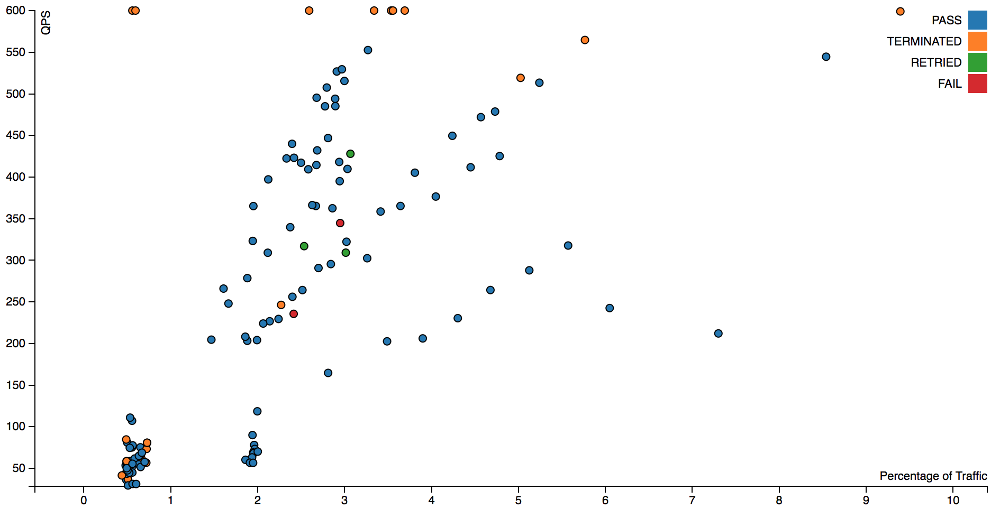
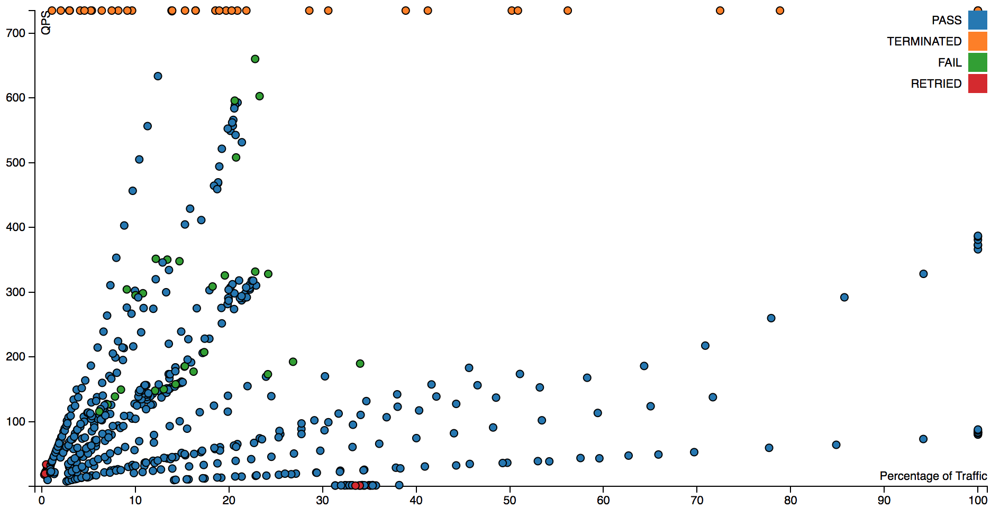
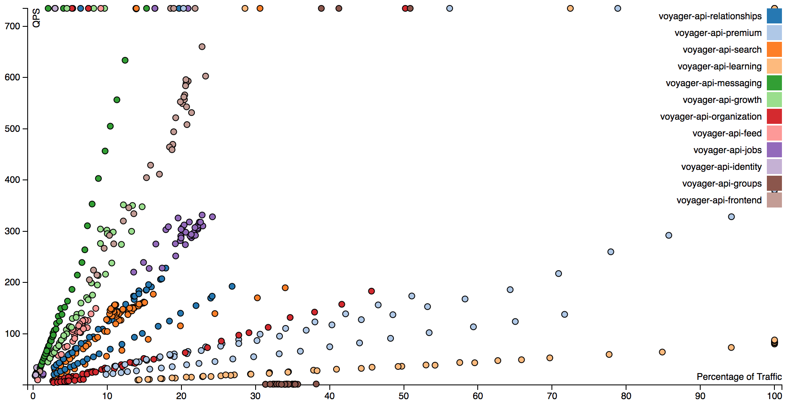

+++
title = "Ceci N'est Pas"
date = "2018-10-12"
slug = "ceci-n-est-pas"
draft = false
+++

Every now and again I get a hankerin' to _fiddle around with data viz that _*isn't*_ inGraphs_. This week, I wanted to take a peek at some _redliner_ numbers to see if I could tease something interesting out of them. My goals were pretty simple:

1. Generate a scatter plot that showed all of the data for each run (not just the Redline Number), and

2. Hack it together in 90 minutes or fewer (cuz I've got Shit to Do)

_I started off taking a look at redliner runs for comm-inbox-bps_:

As an artifact of how the chart is created the terminated (orange) line across the top all have NaNs for their QPS values. It's kind of all over the place, but I believe the lines that can be visually picked out moving up-and-to-the-right are individual redliner runs. I could probably find some way to make this more obvious...but again, I was strictly time-boxing myself.

I also wanted to take a look at _voyager-api:_

In this case, the visual lines are actually *not* individual runs...they're runs for each deployable (read: pillar) within the voyager-api multiproduct. Let's color _them by deployable instead of by step status, shall we?_

Ah, now we're getting somewhere! The higher-QPS pillars (like Messaging) show up pretty clearly as having steeper slopes, with the lower-QPS services (like Learning) having much shallower slopes; so shallow, in fact, that in some cases it's actually possible for a single node to handle 100% of the traffic in a given fabric. Coolness. I'm not sure exactly how useful it is at present - maybe with more data points and/or a different way of presenting it (for instance, by individual run instead of by pillar). ...but it's interesting, and really quite lovely.
