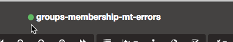

+++
title = "Two Hard Things"
date = "2018-10-19"
slug = "two-hard-things"
draft = false
+++

There's an [old trope I refer to more than anyone probably should: ](https://martinfowler.com/bliki/TwoHardThings.html)*There are only two hard things things in Computer Science: cache invalidation and*

*naming things.* The vast majority of the time when I bring it out I'm talking about the latter (host/fabric naming conventions, anyone? ), but at least *some* of the time I'm talking about the former. This is one of those times.

Folks who spend any significant amount of time using inGraphs are likely to have noticed that sometimes the inGraphs don't load, or don't show the data that were expected. Thanks to a little investigation from _Tim Toll and some helpful explanation from __Fellyn Silliman_, I now know why this is the case. The tl; dr: inGraphs caches dashboard data, and sometimes - in strictly technical terms - the cache ain't right.

So what can you do about it? Well, as it turns out there's a relatively obscure little button that forces a cache refresh:

Click that lil green guy, it'll give you a spinning gear followed by a thumbs-up, refresh the page...*et voila!*

Unfortunately, I don't have any before-and-after images of this in action - if any igotw readers have captured screenshots please send them my way and I'll update the post.

Happy Friday, folks!
