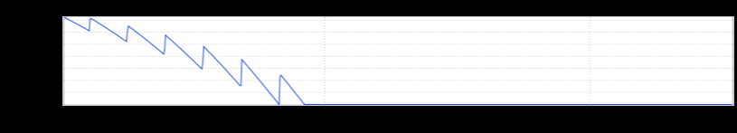

+++
title = "Flatline Redux"
date = "2018-11-08"
slug = "flatline-redux"
draft = false
+++

_I've got a couple of recent inGraphs that were sent my way by Antonio Gurgel_. Both are examples of the _flatline pattern. Let's start off with The Bad One: _

In addition to reminding me of Sonic the Hedgehog, this is a graph you probably don't want to see. Shit can get weird when filesystems fill up - particularly the /var filesystem - so free space going to 0 is most likely undesirable.

The Good One:

Once again, we're looking at the /var filesystem - this time in terms % used. In the earlier part of the graph the percentage wildly undulates until it just kisses (and sometimes exceeds) the 90% threshold. The flatline in this case isn't actually "flat" - it's just a much tighter pattern of growth & cleanup due to a change in log retention policy.

Also, it kinda makes me think of a chainsaw.

Or Fight Club. "On a long enough timeline..."
