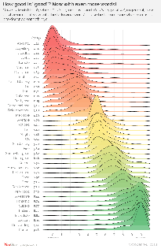
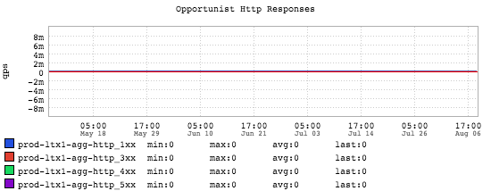
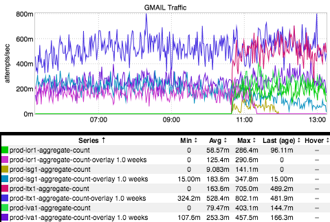
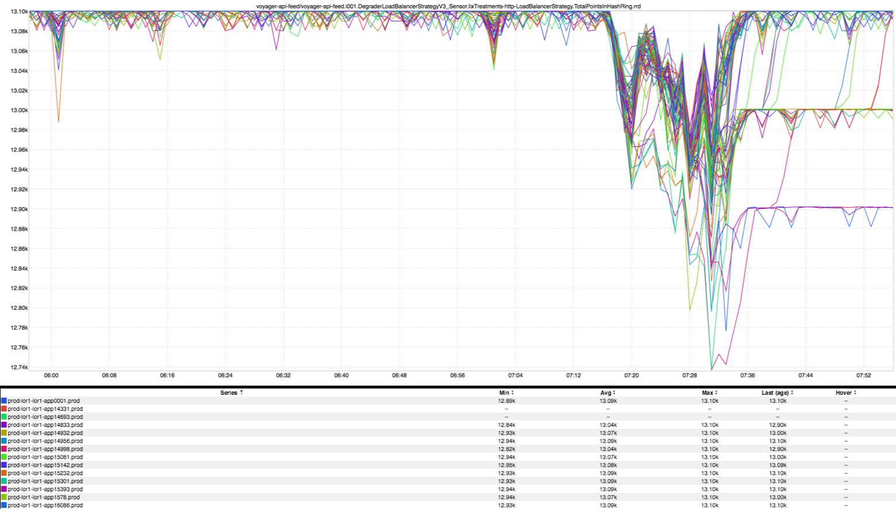
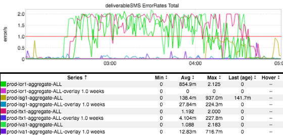
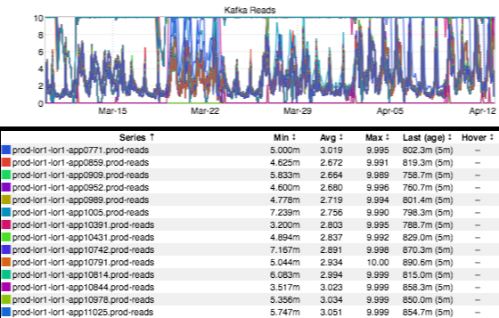
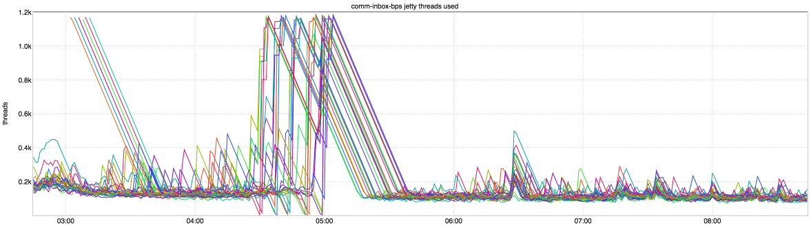

+++
title = "Unintentional Art (BIYP Edition)"
date = "2018-11-16"
slug = "unintentional-art-biyp-edition"
draft = false
+++

Today is _Bring In Your Parents Day_. I brought my mom in to see the campus, see what I do, and partake in the festivities. In that spirit I thought it might be fun for her to participate in this week's igotw. So...I sat her down in front of my MBP, pointed her toward a directory with something on the order of 1100+ graphs, and asked her to pick out whichever ones she thought I ought to post.

Mom overdelivered a bit; after 15-20 minutes she'd picked out 10 or so graphs and I had to shut her down. Below are the ones she chose.

This first one is actually not an inGraph, but I'm glad she picked it. This is the distribution of a survey I stumbled across a little while back asking folks to rate the relative "goodness" or "badness" of given words. It's really quite lovely.

This next one she picked because she thought it would make kind of a cool wallpaper for her phone.

My personal favorite in terms of her reason for selecting this next one: "I picked it because it looked like Nothing, and I thought that might Mean Something." (Mom dropping some mad wisdom...)

A little less on the Zen side: "I picked this one because it had GMAIL in the name." Hm. Okay.

...and the rest? They just basically caught her eye/were pretty/had interesting patterns in them. In no particular order...enjoy!

Happy Friday, Happy inDay, and Happy BIYP Day, folks!
