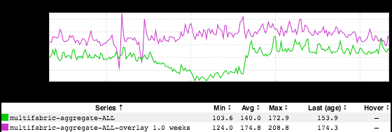

+++
title = "Happy Thanksgiving"
date = "2018-11-23"
slug = "happy-thanksgiving"
draft = false
+++

[You may have noticed that the office was a bit of a ghost town on Wednesday. Welp...as it turns out there was an Espresso storage node that decided to d](https://jira01.corp.linkedin.com:8443/browse/GCN-28084) [uck out a bit early](https://jira01.corp.linkedin.com:8443/browse/GCN-28084) for the 4-day weekend, too.

To horribly mangle a Dostoyevsky [quote*: "In spite of all possible moratoria you are in complete slavery to your storage layer."](https://www.cliffsnotes.com/literature/n/notes-from-underground/summary-and-analysis/part-1-section-4/part-1-section-4-1)

Ah, well. Hopefully this was the only GCN to mar an otherwise quiet holiday weekend. Happy Thanksgiving, folks!

** - Yes, I linked to Cliff's Notes above. Yes, I think it's funny, too.*
