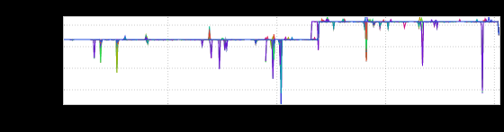
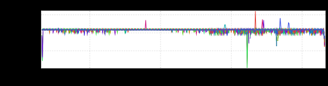
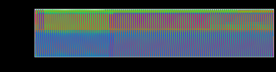
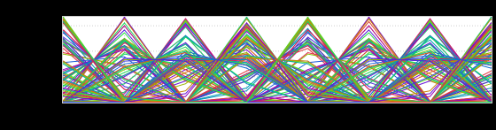

+++
title = "Fractals"
date = "2018-11-29"
slug = "fractals"
draft = false
+++

*This week's post comes from* *Josh Briefman. He came across an interesting inGraph that exhibits patterns within patterns. Let's take a look.*

*In Josh's own words:*

At 8 week’s, it looks kinda blah:

[https://ingraphs.prod.linkedin.com/container/notifications-service/graph/notifications-service/notifications-service.i001.R2_Client_Sensor.](https://ingraphs.prod.linkedin.com/container/notifications-service/graph/notifications-service/notifications-service.i001.R2_Client_Sensor.R2_Client_Sensor_-_http-__r2d2DefaultClient___-_lixClientContexts.CallCountTotal.rrd?fabric_groups=prod&filter=D2&duration_unit=weeks) [R2_Client_Sensor_-_http-__r2d2DefaultClient___-_lixClientContexts.CallCountTotal.rrd?fabric_groups=prod&filter=D2&duration_unit=weeks](https://ingraphs.prod.linkedin.com/container/notifications-service/graph/notifications-service/notifications-service.i001.R2_Client_Sensor.R2_Client_Sensor_-_http-__r2d2DefaultClient___-_lixClientContexts.CallCountTotal.rrd?fabric_groups=prod&filter=D2&duration_unit=weeks)

But if you zoom in to 8 days, an interesting pattern begins to emerge:

[https://ingraphs.prod.linkedin.com/container/notifications-service/graph/notifications-service/notifications-service.i001.R2_Client_Sensor.](https://ingraphs.prod.linkedin.com/container/notifications-service/graph/notifications-service/notifications-service.i001.R2_Client_Sensor.R2_Client_Sensor_-_http-__r2d2DefaultClient___-_lixClientContexts.CallCountTotal.rrd?fabric_groups=prod&filter=D2&duration_unit=days) [R2_Client_Sensor_-_http-__r2d2DefaultClient___-_lixClientContexts.CallCountTotal.rrd?fabric_groups=prod&filter=D2&duration_unit=days](https://ingraphs.prod.linkedin.com/container/notifications-service/graph/notifications-service/notifications-service.i001.R2_Client_Sensor.R2_Client_Sensor_-_http-__r2d2DefaultClient___-_lixClientContexts.CallCountTotal.rrd?fabric_groups=prod&filter=D2&duration_unit=days)

It only gets better at 8 hours, look at those colors:

[https://ingraphs.prod.linkedin.com/container/notifications-service/graph/notifications-service/notifications-service.i001.R2_Client_Sensor.](https://ingraphs.prod.linkedin.com/container/notifications-service/graph/notifications-service/notifications-service.i001.R2_Client_Sensor.R2_Client_Sensor_-_http-__r2d2DefaultClient___-_lixClientContexts.CallCountTotal.rrd?fabric_groups=prod&filter=D2) [R2_Client_Sensor_-_http-__r2d2DefaultClient___-_lixClientContexts.CallCountTotal.rrd?fabric_groups=prod&filter=D2](https://ingraphs.prod.linkedin.com/container/notifications-service/graph/notifications-service/notifications-service.i001.R2_Client_Sensor.R2_Client_Sensor_-_http-__r2d2DefaultClient___-_lixClientContexts.CallCountTotal.rrd?fabric_groups=prod&filter=D2)

And finally, at 8 minutes, we can see the pattern that builds that beautiful graph above:

[https://ingraphs.prod.linkedin.com/container/notifications-service/graph/notifications-service/notifications-service.i001.R2_Client_Sensor.](https://ingraphs.prod.linkedin.com/container/notifications-service/graph/notifications-service/notifications-service.i001.R2_Client_Sensor.R2_Client_Sensor_-_http-__r2d2DefaultClient___-_lixClientContexts.CallCountTotal.rrd?fabric_groups=prod&filter=D2&duration_unit=minutes) [R2_Client_Sensor_-_http-__r2d2DefaultClient___-_lixClientContexts.CallCountTotal.rrd?fabric_groups=prod&filter=D2&duration_unit=minutes](https://ingraphs.prod.linkedin.com/container/notifications-service/graph/notifications-service/notifications-service.i001.R2_Client_Sensor.R2_Client_Sensor_-_http-__r2d2DefaultClient___-_lixClientContexts.CallCountTotal.rrd?fabric_groups=prod&filter=D2&duration_unit=minutes)

Patterns building on patterns....just lovely. Thanks, Josh!
