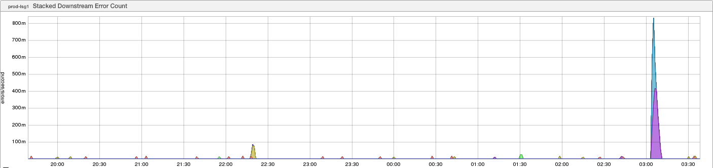
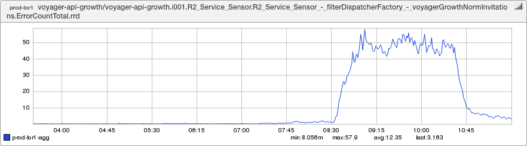
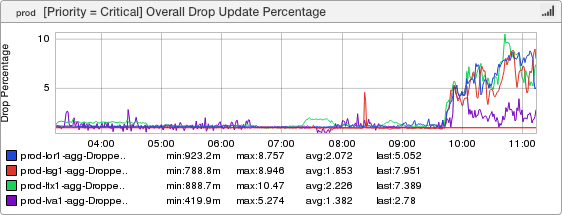
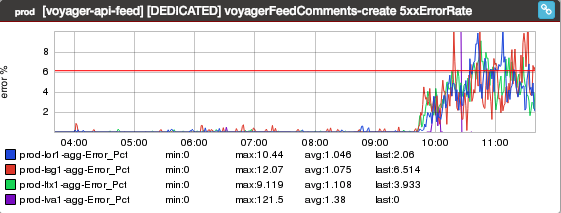
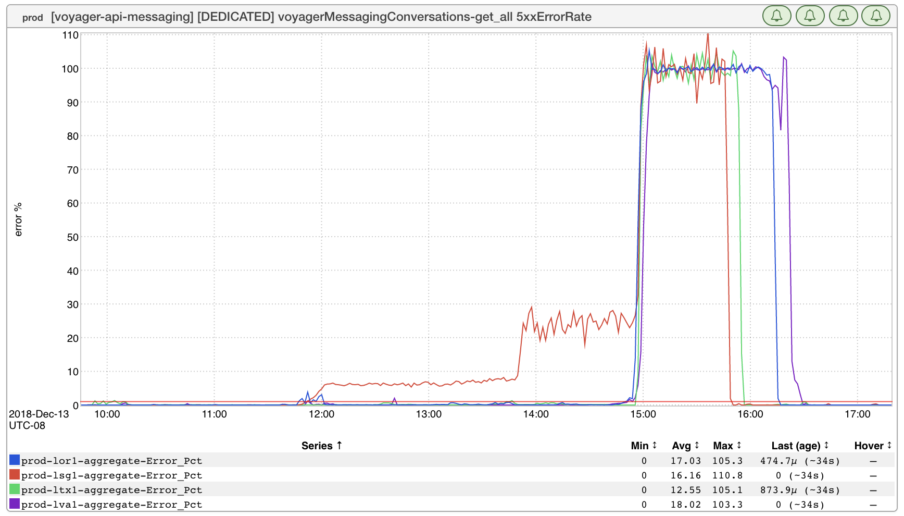

+++
title = "On Moratoria"
date = "2018-12-14"
slug = "on-moratoria"
draft = false
+++

_A few times a year we enforce a production-wide moratorium - a planned pause on all deployment activity. The intent is to reduce the likelihood that _ something will break during major holidays and/or periods when there won't be a whole lot of folks around to dig in and fix issues, and the approach is [largely effective (except when the moratorium schedule mysteriously vanishes and hilarity ensues](https://jira01.corp.linkedin.com:8443/browse/GCN-25043)). That said, anyone who's been around for a while knows that the period immediately *following* a moratorium is a time to hold your breath, cross your fingers, and [hold onto your butts](https://www.youtube.com/watch?v=-W6as8oVcuM). Coders gon' code, and just because we stop deploying doesn't mean the commits stop rolling in. This is basic Ops 101 - the more changes you make the more likely you are to break something, and the longer the period between deployments the bigger the change set, so it stands to reason that there is increased risk of site breakage immediately following a moratorium.

...but what about the time period just *before* the moratorium? What does that look like?

Well...let's take a look at yesterday, shall we?

[login-server: busted.](https://jira01.corp.linkedin.com:8443/browse/GCN-28255)

[invitations: busted.](https://jira01.corp.linkedin.com:8443/browse/GCN-28261)

[feed updates: busted.](https://jira01.corp.linkedin.com:8443/browse/GCN-28264)

[comments: busted.](https://jira01.corp.linkedin.com:8443/browse/GCN-28265)

[messaging: ](https://jira01.corp.linkedin.com:8443/browse/GCN-28266)[**really**](https://jira01.corp.linkedin.com:8443/browse/GCN-28266)[ busted.](https://jira01.corp.linkedin.com:8443/browse/GCN-28266)

_Hoo boy...the DS3 dashboard_ is chock-full o' goodies this morning, isn't it?

Maybe all of the above is entirely coincidental...but I suspect that's not the case. I think most of the folks reading this probably already deeply grok that [tryin](https://en.wikipedia.org/wiki/Project_management_triangle) [g to get the same number of features/commits out under increased time pressure necessarily leads to a decrease in quality, so I guess I'll just say this: Be ](https://en.wikipedia.org/wiki/Project_management_triangle) careful out there, folks. There will always be more commits. *Always.*

Happy Moratorium!
