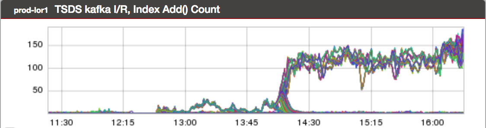
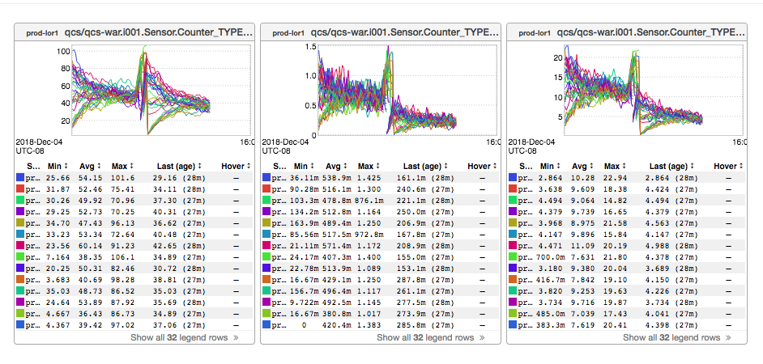
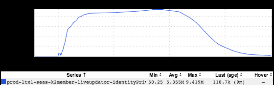

+++
title = "Unintentional Art (DTO Edition)"
date = "2018-12-20"
slug = "unintentional-art-dto-edition"
draft = false
+++

Last year I took DTO the week before the company shutdown. I liked having the last 2 weeks of the year off so much that I decided to go for a repeat performance this year. So far so good - I've stayed away from Slack/email, it's been quiet & relaxing...but ask me how I feel about it on, say, the 30th when

the kids have been out of school for a week or so and are bouncing off the walls.

At any rate, here's a few bits of reader-submitted UA that I've saved up for just such an occasion.

Kicking it off, we've got an inGraph from _Dmitrii Sutiagin_ with a really cool moire effect. It looks like water - like light bouncing around on the bottom of a pool:

_Next up, a crazy tree branch from Karrick McDermott_:

These lil guys from _Felipe Salum_ remind me of a trio of triceratops:

_Last but certainly not least, my favorite of the bunch - a submission from Juan Grande_ entitled "The Little Prince":

...what do *you* see?
