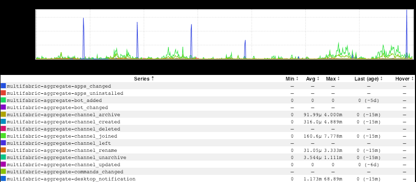
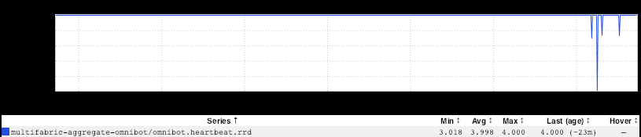
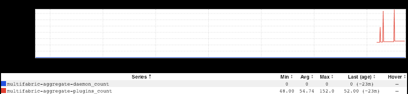
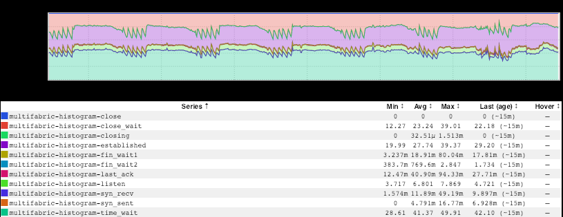

+++
title = "Omnibot"
date = "2019-01-03"
slug = "omnibot"
draft = false
+++

After spending a fair bit of time triaging my ruined post-break inbox yesterday my thoughts turned toward igotw. I've got a bunch of stuff saved off, but what _should I post? ...and then Michael Kehoe came along like a _[gleaming Australian superhero](https://en.wikipedia.org/wiki/Chris_Hemsworth)[ and saved the day! He shot me a graph from an inGraphs ](http://ingraphs.prod.linkedin.com/dashboard/prodsre-omnibot-summary/?fabric_groups=corp) [dashboard](http://ingraphs.prod.linkedin.com/dashboard/prodsre-omnibot-summary/?fabric_groups=corp) for _omnibot - the New Hotness slackbot that prod-sre has been working on._

*Before showing you the inGraphs, I want to issue a disclaimer:* ***omnibot is beta status. omnibot is not production-ready.***

With that out of the way, let's take a look at a few things. I poked around at a few of the graphs in the dashboard. One of the first thing I noticed was [a ](http://ingraphs.prod.linkedin.com/dashboard/prodsre-omnibot-summary/graph/Omnibot:%20Slack%20Incoming%20Event%20Types?fabric_groups=corp&width=735&consolidate=Aggregate&multifabric&use_time_selector&start_time=1544601600000&end_time=1545206400000) [regular spike in file_deleted events](http://ingraphs.prod.linkedin.com/dashboard/prodsre-omnibot-summary/graph/Omnibot:%20Slack%20Incoming%20Event%20Types?fabric_groups=corp&width=735&consolidate=Aggregate&multifabric&use_time_selector&start_time=1544601600000&end_time=1545206400000):

This is probably some kind of log rotation/aging. These happen just after midnight Eastern time, every day (yes, every day - the spikes are just smaller on weekends...I'm assuming there are less logs to clean up due to less activity).

[The next thing I came across](http://ingraphs.prod.linkedin.com/dashboard/prodsre-omnibot-summary/graph/Omnibot:%20Heartbeat?fabric_groups=corp&width=735&consolidate=Aggregate&multifabric&use_time_selector&start_time=1545332160000&end_time=1546541760000):

Huh. Heartbeat looked okay through the break, then started dipping when people got back and started screwing around with it deploying. Making sense. In related news:

Huh. Okay. So maybe one of these deployments resulted in omnibot using more plugins. Much more likely: the deployment resulted in [omnibot emitting ](http://ingraphs.prod.linkedin.com/dashboard/prodsre-omnibot-summary/graph/Omnibot:%20Integrations%20Discovered%20Count?fabric_groups=corp&width=735&consolidate=Aggregate&multifabric&use_time_selector&start_time=1545332160000&end_time=1546541760000) [metrics about the number of plugins it's using](http://ingraphs.prod.linkedin.com/dashboard/prodsre-omnibot-summary/graph/Omnibot:%20Integrations%20Discovered%20Count?fabric_groups=corp&width=735&consolidate=Aggregate&multifabric&use_time_selector&start_time=1545332160000&end_time=1546541760000) (whereas before it was emitting no such metric). Cool.

_After playing around with the dashboard for the New Hotness for a bit I started wondering about the Old-n-Busted. "Does notabot_ have a dashboard?" I wondered? As it turns out, [it does ](http://ingraphs.prod.linkedin.com/dashboard/prodsre-notabot-frontend-summary/?fabric_groups=corp&width=735&duration_amount=1&duration_unit=weeks&multifabric)[One of the dashboards caught my eye. ](http://ingraphs.prod.linkedin.com/dashboard/prodsre-notabot-frontend-summary/graph/notabotfrontend%20-%20TCP%20states?fabric_groups=corp&width=735&multifabric&use_time_selector&start_time=1545937080000&end_time=1546541880000):

Just a guess - I'd have to spend a little more time thinking about what this means - but at a glance i'd say maybe something upstream with a ~24-hour reconnect policy.

At any rate, thank you _Michael Kehoe_ for giving me confidence that I still remember how to inGraphs, and to prod-sre for the super-helpful Slackbot integrations.

...and also: welcome back from break, folks. Happy 2019.
