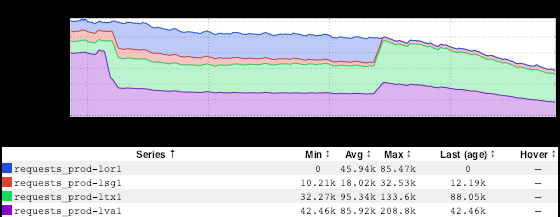
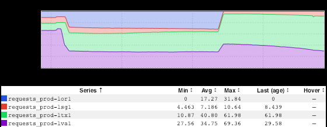

+++
title = "consolidate: Histogram"
date = "2019-01-10"
slug = "consolidate-histogram"
draft = false
+++

This week I'd like to talk a little bit about an inGraphs consolidation that is used relatively infrequently: Histogram.

Backing up a step: inGraphs provides a handful of different ways to consolidate data in meaningful/helpful ways. Consolidation can either be defined in the dashboard or manipulated using the inGraphs UI; see:

Most of these consolidation options are pretty straightforward. Aggregate (sum each series), AggregateAll (sum the sums), Max (the maxima of each series), etc. *[Side note: If you can tell me what the utility/use case for AverageAll is I'd love to hear it.] *   Histogram consolidation is a little more esoteric, but sometimes it can be super-useful so I think it's worth taking a look at...so let's dive in!

First off: it's not going to provide you with a [histogram](https://en.wikipedia.org/wiki/Histogram) in the traditional sense. If you're looking for a bar graph of a probability distribution...well...I'm sorry, folks, that isn't a "thing" in inGraphs. What it *will* give you is a nifty percentage breakdown for a given metric. One of the more accessible examples I can think of is stickyrouting site traffic.

[Here's the inGraph for main partition requests per fabric](https://ingraphs.prod.linkedin.com/dashboard/stickyrouting/graph/main%20partition%20requests%20per%20fabric?fabric_groups=prod):

[...and here's what it looks like if you switch consolidation to "Histogram":](https://ingraphs.prod.linkedin.com/dashboard/stickyrouting/graph/main%20partition%20requests%20per%20fabric?fabric_groups=prod&consolidate=Histogram)

The first graph: per-fabric QPS. The second: *percentage* of overall per-fabric QPS.

Pretty nifty, eh? ...and without having to do any "fancy" RPN magic or anything.
