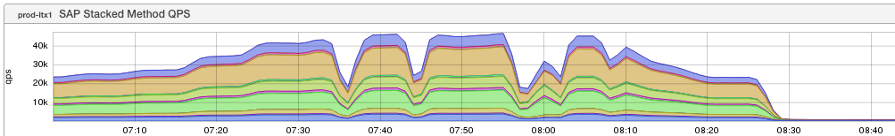
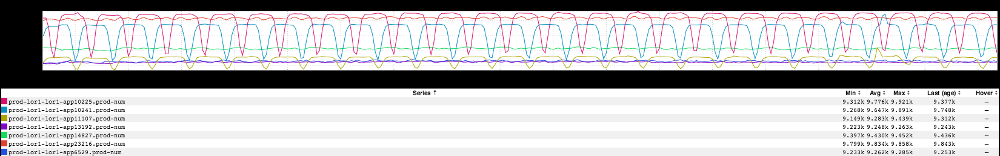
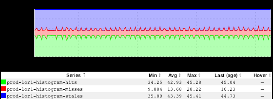
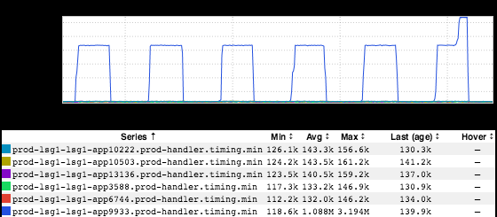

+++
title = "Unintentional Art (January 2018)"
date = "2019-01-17"
slug = "unintentional-art-january-2018"
draft = false
+++

Today we'll take a peek at a handful of inGraphs from the backlog that caught my eye.

This first one reminded me of an AI class I took once upon a time. There was an exercise in searching for a global maximum given a landscape (imagine programming a robot to do this), and I remember a picture super-similar to this one demonstrating local vs. global minima/maxima:

This next one could be used in a toothpaste commercial. When I look at it I imagine animated rows of teeth dancing back-and-forth with one another:

This one (which _Karrick McDermott_ sent my way a little while back) *also* [reminds me of teeth...maybe those of a sawblade, or perhaps a fish](https://www.google.com/search?q=long-nose+gar+teeth&source=lnms&tbm=isch&sa=X&ved=0ahUKEwj2ye3FuvXfAhVXFzQIHZhfAHkQ_AUIDigB&biw=1680&bih=948):

...and this one...huh. Well, with this one I can't help but look at it and sing to myself "[One of these things is not like the other...](https://www.youtube.com/watch?v=rsRjQDrDnY8)"

Also: I assure you that I did *not* set out to do a post almost entirely dedicated to teeth. It just happened that way.
