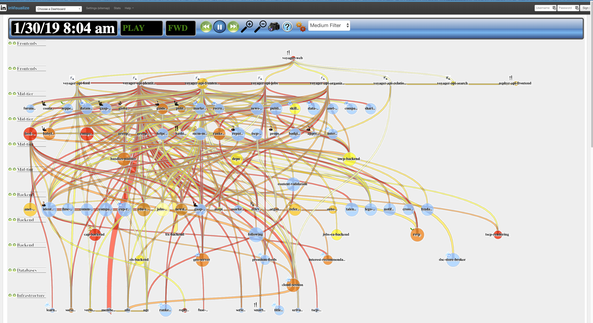
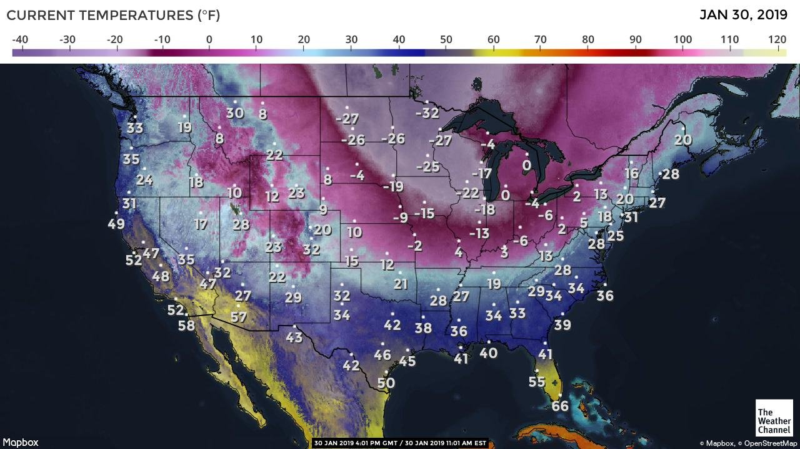

+++
title = "Maps"
date = "2019-02-01"
slug = "maps"
draft = false
+++

_I'd like to showcase a couple of interesting maps I came across this week. One of them - inVisualize_ - leverages inGraphs data to map out relationships between services for different parts of the site. Here's an example of what inVisualize looked like during [a recent GCN:](https://jira01.corp.linkedin.com:8443/browse/GCN-28564)

Huh. That's...somethin'. I have to admit that I haven't spent enough quality time with inVisualize to really grok what it's trying to tell me. That's actually what makes the above interesting to me, why I posted it. I spent a good 5-10 minutes peering at this, trying to mentally untangle the lines, trying to find meaning...and it got me thinking "Is this how people feel the first time they look at an inGraphs dashboard?" Different layout and format, but at a basic level hundreds of _squiggly lines_ that are likely inscrutable to the uninitiated. Intimidating. I really should spend a little more time steeping myself in its lore.

Purely by coincidence, here's another map that I came across at almost the exact same time that the above screenshot was taken:

Hoo boy. This one is a little easier to understand at a glance. I can figure out about where I am without too much trouble (one of the purple "-6" parts), I've got supporting physical stimuli to back up the raw data (it takes very little mental effort to interpret freezing my ass off), and I can use it to immediately draw conclusions (like "Well, at least I'm not in Minnesota.")

Stay warm out there, folks.
