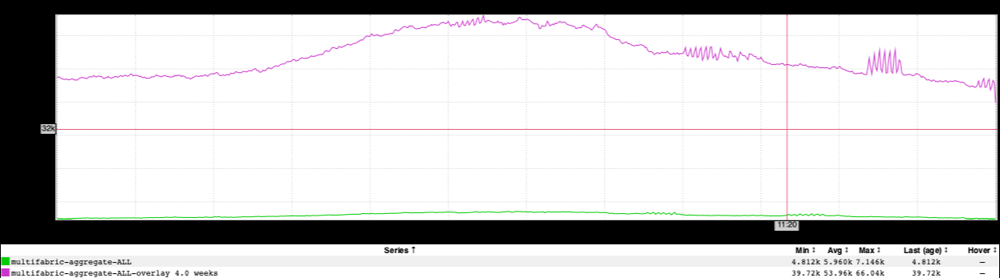
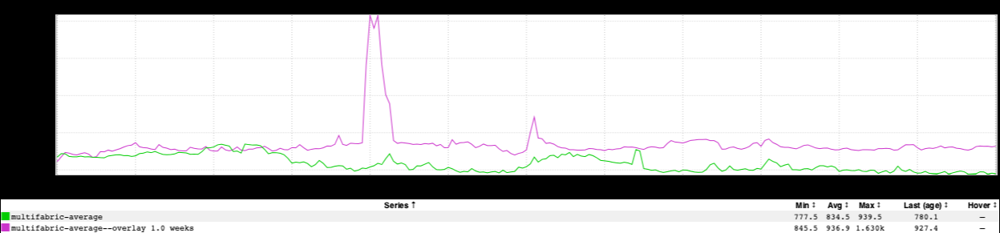

+++
title = "Wins"
date = "2019-02-06"
slug = "wins"
draft = false
+++

*This week I am totally ripping off an email that Nimesh Chakravarthi* *sent out to his team about an operational win. I mean, just shameless plagiarism. So...* *here it is in its mostly-unadulterated form (with minor edits for formatting and to include attribution).*

_I wanted to send out a report on a change that Lenny Dong_ made and also demoed last Friday because we have seen some outstanding results from it.

The change he made optimizes on a nasty request pattern in voyager-api when it communicates with the service responsible for providing information about member restrictions. We were seeing a giant fanout of hundreds of these requests during some calls to the conversation list. Lenny managed to batch these into one single request, and we saw the following improvements:

~90% decrease in downstream traffic to filterRestrictedMembers, which is a ~60k decrease at peak ([inGraph):](https://ingraphs.prod.linkedin.com/container/voyager-api-messaging/graph/voyager-api-messaging/voyager-api-messaging.i001.R2_Client_Sensor.R2_Client_Sensor_-_http-__r2d2DefaultClient___-_filterRestrictedMembers.CallCountTotal.rrd?fabric_groups=prod&consolidate=AggregateAll&multifabric&width=1167&height=258&overlay_amount=4&overlay_unit=weeks&use_time_selector&start_time=1549447200000&end_time=1549490400000)

[Close to a 100ms decrease in p95 latency of the conversation list (inGraph](https://ingraphs.prod.linkedin.com/container/voyager-api-messaging/graph/voyager-api-messaging/voyager-api-messaging.i001.RestLiServer_Sensor.RestLiServer_Sensor_-_restliServlet_-_pillar-voyagerMessagingConversations-get_all.CallTime95Pct.rrd?fabric_groups=prod&consolidate=Average&multifabric&width=1167&height=202&overlay_amount=1&overlay_unit=weeks&use_time_selector&start_time=1549317600000&end_time=1549332000000)). 100% ramp was at 2:56pm on 2/4:

These types of changes highlight the amazing craftsmanship that our team is capable of. Huge shout out to Lenny for getting this out! Can’t wait to see more improvements like this!
