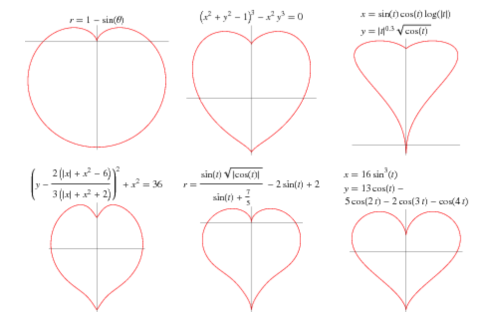

+++
title = "Happy Valentine's Day!"
date = "2019-02-14"
slug = "happy-valentine-s-day"
draft = false
+++

I spent some time poking around my inGraph backlog this morning trying to find a heart-shaped graph. Sadly, I could not find one...so [I turned to The ](http://lmgtfy.com/?q=heart-shaped+graph) [Google](http://lmgtfy.com/?q=heart-shaped+graph)[. After getting momentarily sidetracked listening to the first suggestion for "heart-shaped"](https://www.youtube.com/watch?v=n6P0SitRwy8)[, I found what I was looking for](http://mathworld.wolfram.com/HeartCurve.html):

I found this remarkable. I love how it progresses from the simplest possible equation that produces something heart-like (even if it does also look a little like a butt) and moves through more complex alternatives, each giving a new shape - a different degree of "heartliness".

Happy Valentine's Day, folks. May your shoebox with a mail slot cut into the top be overflowing with miniature "Be Mine" heart candies.
