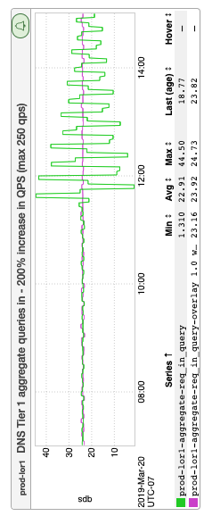

+++
title = "Invisible Infra"
date = "2019-03-22"
slug = "invisible-infra"
draft = false
+++

A [recent GCN](https://jira01.corp.linkedin.com:8443/browse/GCN-28962) got me thinking about invisible infrastructure - the quiet magic that we take for granted...until it ceases to exist. _PIE is still trying to figure out _ [exactly what happened](https://jira01.corp.linkedin.com:8443/browse/DS-2474), but my understanding is that a restart of named - which is typically a routine operation with zero impact - went...well...went all atypical on us. DNS resolution is such a fundamental underpinning technology that when it goes away - even briefly! - Shit Gets Weird.

I kind of liken it to gravity. I'm a fan of "[What If?", and a question I'd like to pose is "What if gravity stopped working for one second?" My hunch? The Most ](https://what-if.xkcd.com/) Major of Major GCNs. Everything we build, everything we do, all of it assumes a constant inward acceleration of 9.8m/s/s. Beyond Earth/humanity, gravity is a [fundamental force that dictates how the entire Universe works. (In case you didn't click through to the Wikipedia article, I'd like to call attention to the ](https://en.wikipedia.org/wiki/Fundamental_interaction) bit about "Affected particles: All particles".) So what *would* happen if gravity just "stopped gravitying" for a second. ...and - perhaps even worse - what would happen in the following second, *when it came back*? I'm not Randall Munroe...my mind gets itself in a twist even trying to think about the implications.

So...what did this GCN "look like"? Well, I could show you any number of inGraphs demonstrating maxed out threadpools, error rates, ermahgerd _lerterncer, etc. Instead, I'm going to pass along this nifty little inGraph that Henry Majoros_ called to my attention; rotated 90 degrees, it bears a striking resemblance to a Christmas tree:

Merry Christmas, folks!
