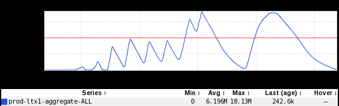
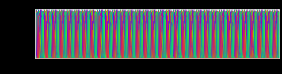
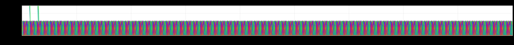
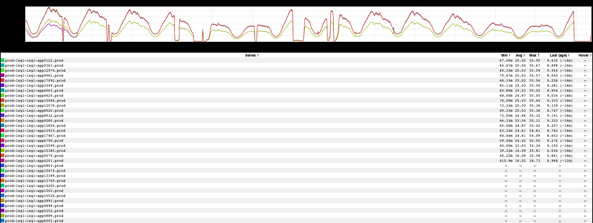
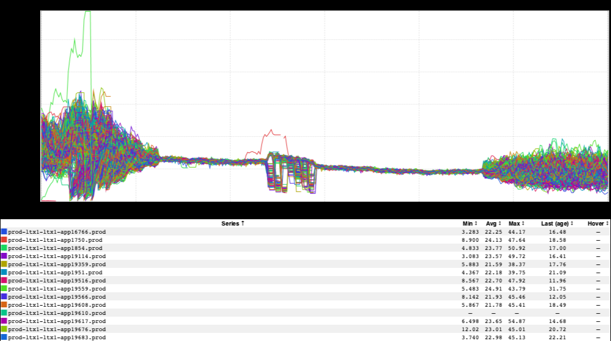

+++
title = "Unintentional Art (SREcon19 Edition)"
date = "2019-03-29"
slug = "unintentional-art-srecon19-edition"
draft = false
+++

I just got back home from Brooklyn where I was attending [SREcon19 Americas. The conference was a good one, but I'm glad to be back home...and I'm ](https://www.usenix.org/conference/srecon19americas)*als*

*o* glad to be heading into the weekend and unlikely to hear "observability" or "SLO" for the next few days.  Anyhow, I've got a few bits 'n' bobs of UA that I've picked up along the way.

_First up are a couple on inGraphs Dmitrii Sutiagin sent my way. This one is from _[GCN-28925:](https://jira01.corp.linkedin.com:8443/browse/GCN-28925)

...and this one isn't from any GCN, but really just kinda looks like a caterpillar:

I played around with the timescale a bit and found that I could take advantage of some occasional spikes in the metric to give the lil guy a pair of antennae:

I stumbled across this one a week or two ago by accident:

I'm not entirely sure why there are a handful of nodes receiving less traffic on this endpoint...but the graph makes me think of what it might look like if Dr. Seuss designed a fairly long bridge.

Similarly, we've got some more weird load balancing and bridgeliness from _Chris Stufflebeam_:

Happy Friday, folks!
