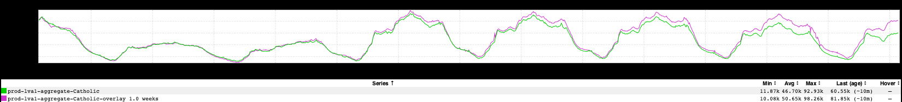
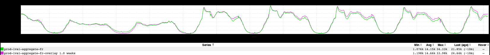

+++
title = "Holy Week 2019"
date = "2019-04-19"
slug = "holy-week-2019"
draft = false
+++

I woke up this morning wondering to myself "What might site traffic look like in predominantly-Catholic countries - the ones whose demography is composed of a plurality (if not an outright majority) of Catholic folks?" Well, as it turns out, there's an inGraph for that:

This is roughly what I expected; site traffic starting off inline week-over-week and starting to diverge going into Easter Sunday. The keen eye might pick out a sharper-than-usual dip in the evening on 4/15 (times are in UTC). ICYMI, [the Notre Dame Cathedral caught fire this week. So let's take a look at France, ](https://www.theguardian.com/world/2019/apr/16/notre-dame-cathedral-fire-a-visual-guide-and-timeline) shall we?

A couple of things stand out in this one. First, there's the sharp dip around the time the cathedral was burning. (BTW - I'd *love* to see similar metrics for other social media during that timeframe. My suspicion is that they would move in more or less the opposite direction.)  You can also start to see the Holy Week divergence going into the weekend, but it's not nearly so pronounced as it was when aggregated with the rest of the predominantly-Catholic countries. This may be because Catholicism - while [the single-largest denomination](https://en.wikipedia.org/wiki/Religion_in_France) - accounts for <50% of the population.

...but there's something else interesting here...a week in the life of the French, right? The lulls at night and over the weekend (this is not unique to the French). The uptick at the beginning of each working day - perhaps they're scrolling through the feed while commuting, or spending the first 20 minutes at work "catching up" before starting the business of the day in earnest. The regular dips at lunch- and dinner-time (the French do *not* mess around when it comes to meals). When I look at a graph like this I start to construct a narrative in my head - a story about what Jacques and Mathilde have been up to this week.

Anyhow...have a Good Friday (hur hur see what I did there?) and a Happy Easter, folks!
