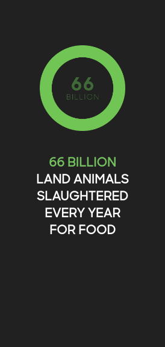
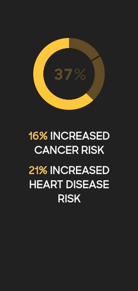

+++
title = "Chartjunk"
date = "2019-05-09"
slug = "chartjunk"
draft = false
+++

[If there's one person who I consider to be an expert on data visualization, it would be Edward Tufte](https://en.wikipedia.org/wiki/Edward_Tufte). I'm pretty sure I've referenced him here before, but for [those who haven't heard of him Tufte quite literally wrote the book on The Visual Display of Quatitative Information](https://www.amazon.com/Visual-Display-Quantitative-Information/dp/0961392142/)[. In this book he coins the term chartjunk](https://en.wikipedia.org/wiki/Chartjunk) to refer to visualizations with unnecessary elements of decoration that add zero value; i.e., ornamentation that conveys no additional information. In fact, in some cases chartjunk actually provides *negative* value, actively distorting the data and making it harder to interpret (sometimes accidentally, sometimes intentionally).

[There are examples of chartjunk everywhere, and in the 15 or so years since I first read this book I've been on the lookout for them. I'd like to share a ](https://www.google.com/search?q=chartjunk)

couple of examples I stumbled upon recently in the hopes that after reading this post you'll be on the lookout for chartjunk, too.

[Beyond Meat](https://www.beyondmeat.com/) is an organization whose mission is "to create The Future of Protein® by offering mass-market solutions that perfectly replace animal protein with plant protein." I love me some animal protein, but I'm not here to riff on their mission. I believe that *they* believe they are making the world a better place, and so far as I know they're not hurting anyone. Nobody is coming to take my ham sandwich away and replace it with a kale smoothie...so be it.

[However. Their "About" page has a couple of shining examples of chartjunk, and...well...The Dude can't abide.](https://www.beyondmeat.com/about/)

Let's take a peek, shall we?

In the category of "Improving Animal Welfare" they've got this little guy:

Now, this isn't actually egregious. It's not misleading and only minimally distracting. That said, it's a donut chart representing exactly one number, which begs the question: why have a chart at all? What is the value in having a green ring? Well, I suppose you could make the argument that it makes sense in [the greater context of the About page overall; there are four charts...maybe the designer wanted to keep a consistent aesthetic for each of the data points ](https://www.youtube.com/watch?v=1npL-TNFOAQ) being presented. Fair nuff.

Moving on, let's take a look at what they're doing in the space of "Improving Human Health":

Oh. Oh chile. Here we've got something else entirely. First off, again, we're only talking about 2 numbers here (that have been squashed into one number... more on that later), so why have a chart at all? Why not just give the numbers? Digging a little deeper, take a close look at the colors. You might've noticed that the foreground color - the bright one, the one that catches the eye - takes up the majority of the donut chart. The background color is the one they selected to actually represent the "37%" that they're talking about. There's a notch in the upper righthand quadrant - presumably to delineate between the "16%" and "21%" that they're combining - but at a glance that's not even going to register. What   going to register at a glance: "They've got the biggest *is* piece of the pie". We could give the benefit of the doubt and chalk this up to a bad design decision, but this is getting *dangerously* close to the territory of presenting the data in a way that is intentionally misleading.

Even more fundamental than that: look at the numbers they're combining to come up with 37%. I'm reasonably good at arithmetic. I understand that 16+21=37. ...but...are they adding cancer risk to heart disease risk? Can they do that? What   the sum of cancer and heart disease? What does it even *is* mean? Hell, why not throw in the 66 billion from before? Think of the potential Vision statement! "Making the world sixty-six-billion and thirty-seven percent Moar."

Breathtaking.
