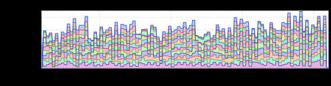
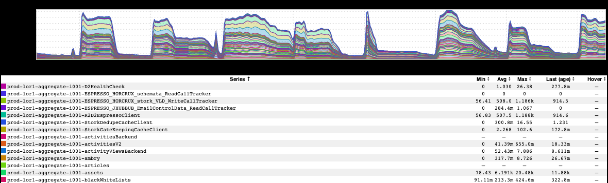
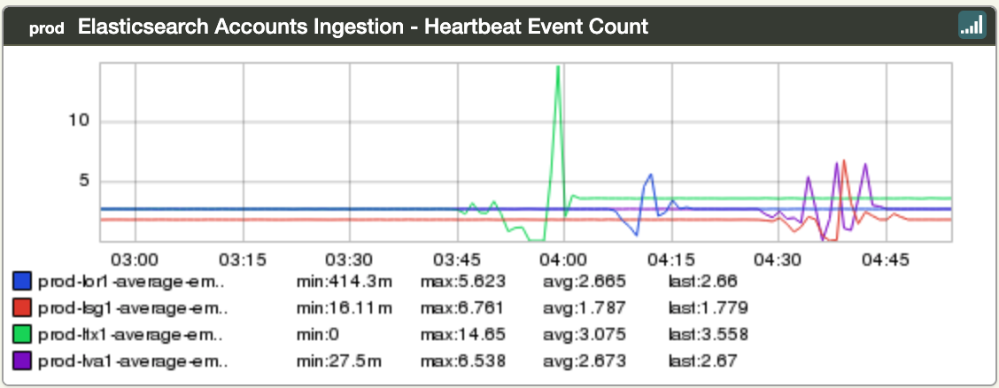
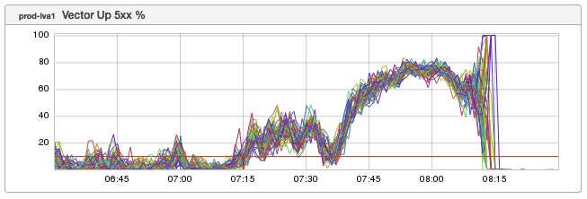

+++
title = "Unintentional Art (May 2019)"
date = "2019-05-23"
slug = "unintentional-art-may-2019"
draft = false
+++

I reckon it's been a little while since I posted any kind of an inGraph. Let's take a peek at a few UA bits 'n' bobs, shall we?

First up is a nice little stacked graph that, as _Josh Briefman pointed out, looks a bit like a city skyline:_

The thing I like about this one is that it's effectively a pseudo-random skyline generator; if you fiddle with the timelines, you can generate a whole multitude of different skylines. (Here's [the link](https://ingraphs.prod.linkedin.com/dashboard/amplify-sre_-static_flock_mail_common/graph/prod_out_msys%20reject%20jlog%20size) if you wanna fiddle with it.)

Similarly, this lil guy looks like a sort of alien landscape:

It makes me think back to a machine learning class I took, where this kind of picture would be used to demonstrate the difference between local and global minima/maxima.

_Then there's this appropriately-named inGraph that Nick Brown_ sent my way:

I can't help but wonder if its creator imagined that one day it would actually *look* [like a heartbeat, in the form of an electrocardiogram](https://en.wikipedia.org/wiki/Electrocardiography).

Next up is one that I'm dubbing "When Do You Think It Ramped?":

...and finally:

At first glance this one kinda made me think of a monitor mounted on some kind of a flexible arm, but the more I look at it the more I feel a kind of energy. It's as though some invisible hand is pressing in from the right, halting forward progress and compressing everything to the left. Or perhaps this is a point- [in-time snapshot of what it looks like when the Unstoppable Force meets the Immovable Object](https://en.wikipedia.org/wiki/Irresistible_force_paradox)? Huh.
