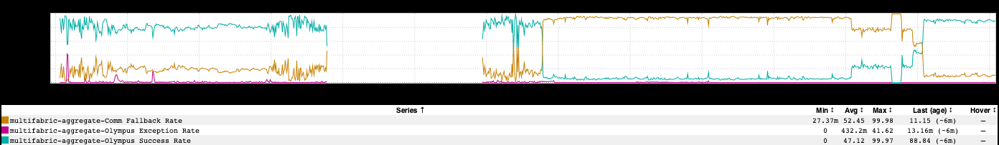

+++
title = "Ups 'n' Downs"
date = "2019-06-13"
slug = "ups-n-downs"
draft = false
+++

A common pattern for migrating from one data source/platform/endpoint to another in a non-disruptive way is to do dual reads. The concept is pretty basic: you make calls in parallel to both the "old" and the "new" endpoint. For some period of time you rely on the result from the old endpoint and discard the result from the new one, and then you have some mechanism (typically - but not always - a lix) for reversing that logic and considering the new endpoint to be the source of truth. If you're Doing It Right(tm) you've got some way of building confidence that the new endpoint is working as intended before cutting over entirely. One such way is demonstrated below:

The approach being used in this case is simply to compare the results from the new and old endpoints. If the results match, emit a "Success" metric. If they *don't* match, emit a "Fallback" metric and fall back to using the results from the old endpoint (in this case, "Comm"). Oh, and if it blows up entirely emit an Exception metric (smart). ...and then wrap all that up in an RPN that shows a nice percentage.

In addition to looking rad, there are a couple of interesting things that can be teased out. [Caveat: I do not actually know exactly what happened here.] It starts out pretty okay - about 80% of the time the new endpoint is returning matching results. After that there are a couple of weeks of no data; my assumption is that dual read was ramped down for some reason during that timeframe. Around 4/25 it looks like dual read was turned on again...and shortly after that - beginning of May - things get interesting. The metrics basically flip. It looks like maybe some kind of a bug was introduced into the new endpoint.

That first week of June? Man...I don't even have a strong guess for what those gyrations are all about. Maybe some attempts to fix the bug - some of which made things better, at least one of which made it worse? ...and finally, as of June 6, it looks like the bug is (mostly) fixed.

Cool stuff.

*[Thanks to* *Avik Das* *for suggesting this post, and to* *Lenny Dong* *who I believe was responsible for doing the needful to make things right. I suppose I*

*could've asked either of them what* actually *happened...but I thought it might be more fun to make up a narrative based on what I saw in the graph.* *]*
